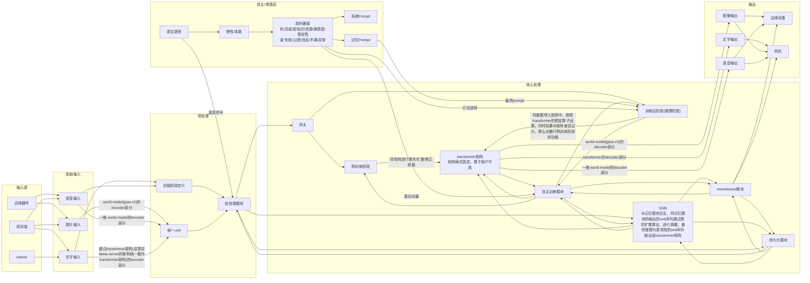

%% 注释
%% 目标: 前处理模块
%% 记忆模块:
%% 1.短期内采用concat，中期采用rnn通过将图片看作张量后进行类似于rnn的方式查询，长期将其看作为lstm进行记忆
%% 2.存在一种最长期的记忆，称为本能，本能不会改变，只在预训练的情况下定义，本能是跨session存在的

%% 目标: 前处理模块
%% 情感模块:1.短期内称为情绪，情绪被定义为一个与transformer行列相同的矩阵，发挥作用时与transformer矩阵进行矩阵乘法。情绪的作用方式和影响方式参见文档库中对情感模块的定义
%% 2.长期内称为情感，情感定义与情绪相同，当检测到情绪的矩阵要与transformer矩阵运算时，情感矩阵与其进行矩阵乘法，但是该矩阵的变化范围远远小于情绪的矩阵，同时其变化时间远远长于情绪系统

%% 目标: memebarier模块
%% memeBarrier模块，基于GNN模块而得，检测GNN模型-unit上一层的meme层的自指率过高等特征的模因并封禁其对应词为停用词并对最终前端发出警告

%% 目标: 初始阶段定义
%% 定义模型超参，最初目标等等(部分存入最长期记忆)

%% 目标: 自主训练模块
%% 主要包含对transformer,gnn等的热点加速技术，对gnn的三种自主学习和联想技术，对memebarier的准确性增强，对transformer的优化和残差分析模块
%% 从训练阶段/推理阶段/gnn阶段获取数据并进行分析，最终直接影响全部模块

%% 目标: 持久化模块
%% 持久化模块可以暂存快照，快照主要通过Lmdb完成，主要对gnn,记忆模块，情感模块进行存储
%% 并且可以借此在下一轮启动的过程中恢复快照并跳过预训练阶段
