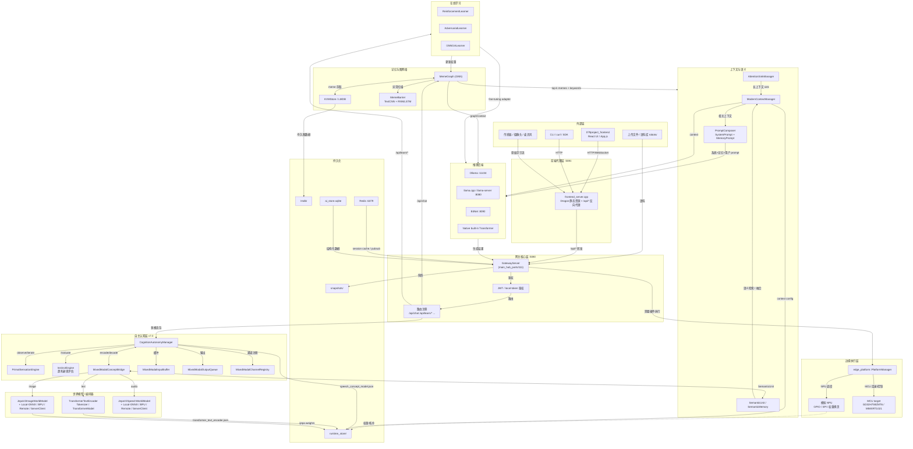
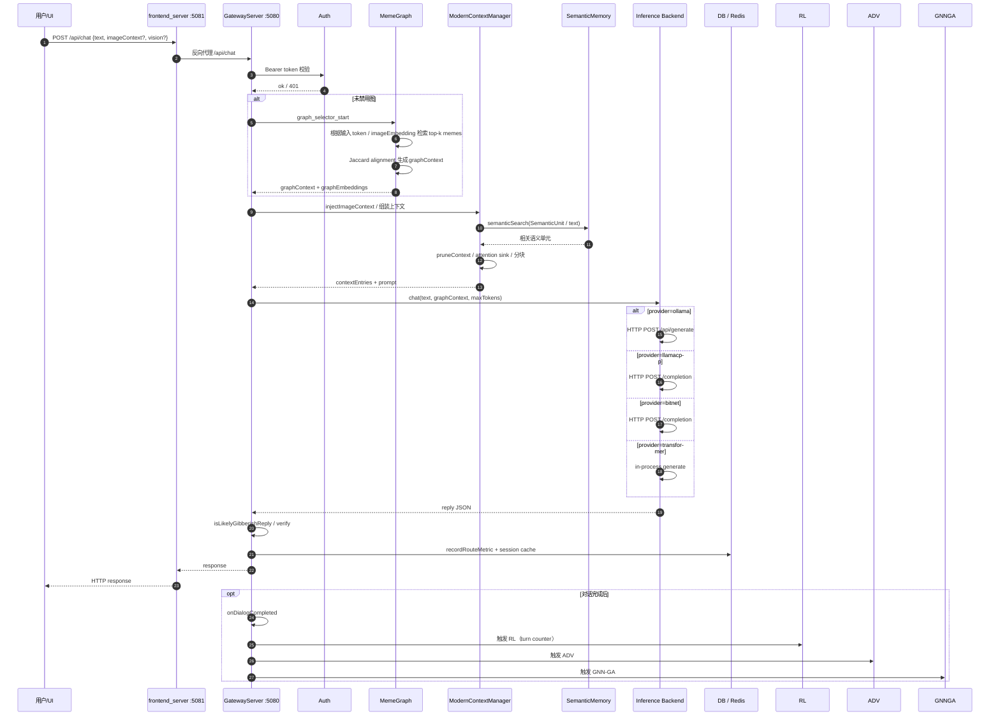
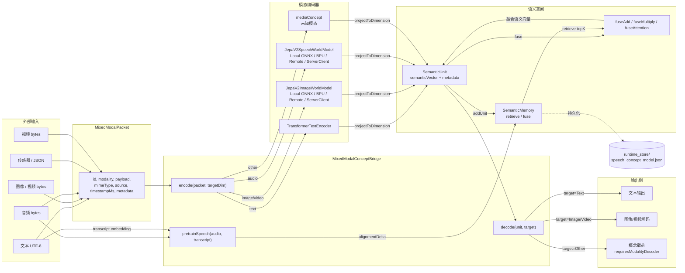
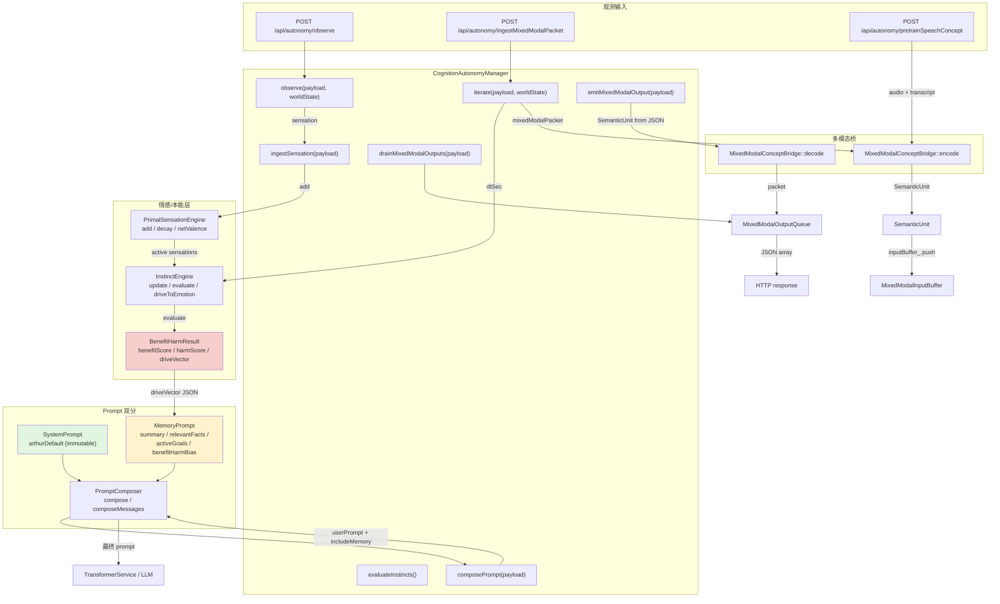
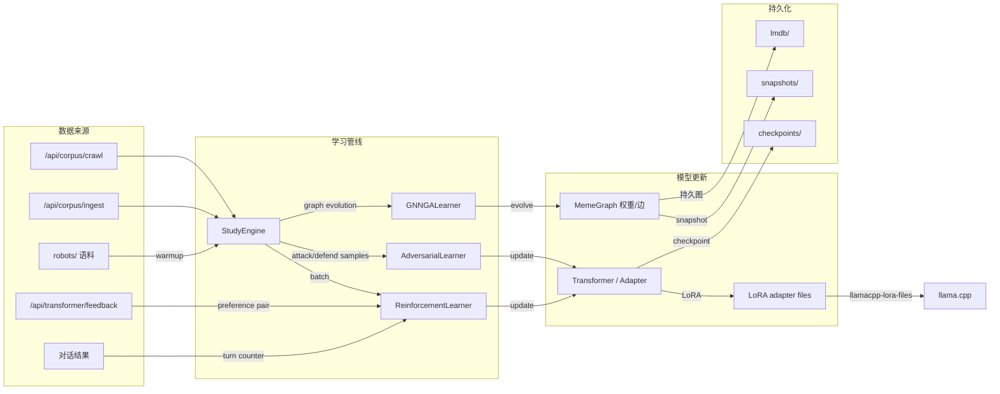
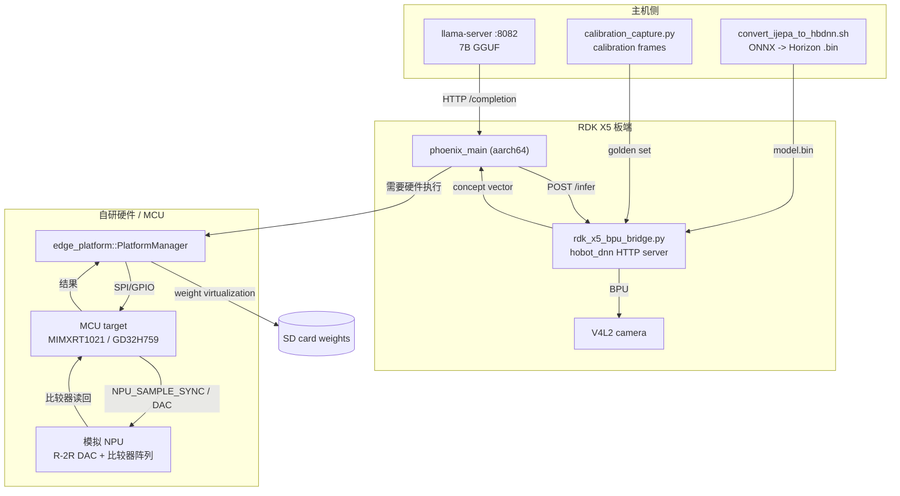
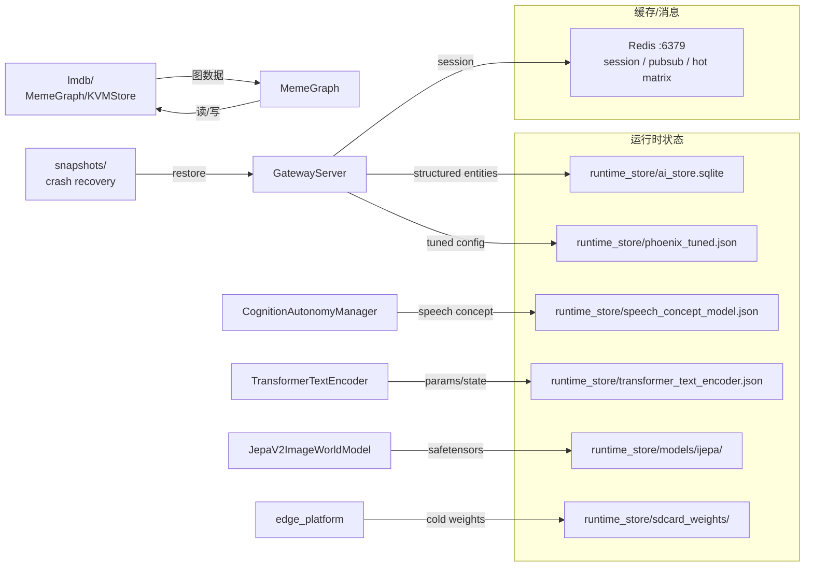
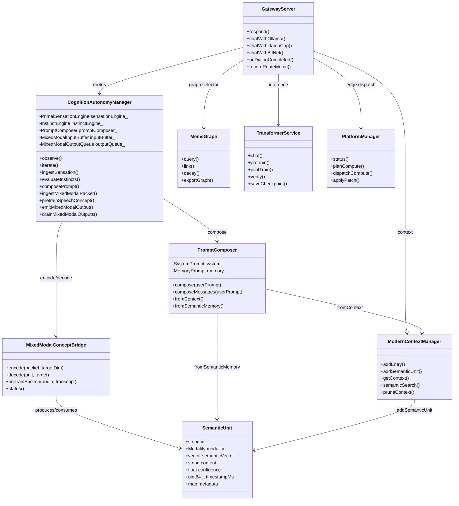
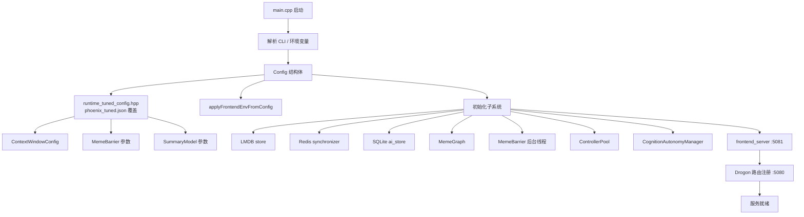

# Phoenix v7.0 "Arthur" 数据流与架构文档

本文件基于 `v7.0.md`、`workflow.md`、`algorithm.md` 以及 Phoenix v7.0 实际源码（`main_hub_parts`、`autonomy_stack.{hpp,cpp}`、`external_mixed_modal_io.{hpp,cpp}`、`semantic_unit.{hpp,cpp}`、`prompt_split.{hpp,cpp}`、`edge_platform.{hpp,cpp}`、`frontend_server.cpp`、`transformer.hpp`、`modern_context_system.hpp`、`rdk_x5_bpu.{hpp,cpp}` 等）绘制完整数据流图。所有图使用 Mermaid 语法，便于后续导入可视化工具或本仓库的 `tools/mermaid_flow_editor/`。

---

## 1. 整体架构（按子系统分层）

**说明**：外部请求统一经过 `frontend_server.cpp` 反向代理到达网关 `GatewayServer`；网关负责鉴权、路由、记忆图（MemeGraph）、上下文、自主认知层以及推理后端调度；边缘层负责将部分算子或权重下放到 NPU/MCU 执行；持久化层为所有子系统提供状态保存与恢复能力。

---

## 2. `/api/chat` 请求生命周期

**说明**：

1. `frontend_server.cpp` 仅做代理，不处理业务逻辑。
2. 鉴权支持 JWT 与 `local-{user}-{ts}-{seq}` 本地 token。
3. `/api/chat` 默认启用 MemeGraph selector，可通过 `disableGraphSelector` 关闭。
4. 图像上下文通过 `injectImageContext` 注入，可能进入 `jepa_v2_image_world_model` 编码为语义单元。
5. 生成完成后会进行 `isLikelyGibberishReply` 与可选的 verify，并异步触发在线学习。

---

## 3. 多模态真连接数据流

**说明**：

- `MixedModalPacket` 是统一的外部输入/输出容器；`MixedModalConceptBridge` 负责将不同模态编码到同一语义空间。
- 文本走 `TransformerTextEncoder`；图像/视频优先使用 `JepaV2ImageWorldModel`（真实后端可切换为 RDK X5 BPU 或 PyTorch）；音频使用 `JepaV2SpeechWorldModel`，并可通过 `pretrainSpeech` 与文本对齐。
- 所有语义向量通过 `projectToDimension` 对齐到目标维度，实现不重新训练 LLM 的跨模态融合。
- 解码时，非文本目标输出概念载荷并标记 `requiresModalityDecoder`，由外部解码器实体化。

---

## 4. 自主认知层（Autonomy Stack）内部循环

**说明**：

- `observe()` 接收外部观测，可包含原生感受（sensation）或多模态包；`iterate()` 是主循环，每次计算时间差 `dtSec` 并更新本能强度。
- `InstinctEngine::update()` 根据感受匹配分和时间半衰期更新当前激活度；`evaluate()` 计算 benefit/harm 并输出 8 维 `driveVector`。
- `MemoryPrompt.benefitHarmBias` 不再硬编码为 `approach/avoid/wait`，而是直接写入 `driveVector` 数值权值，作为下游矩阵（如 logit-bias）的潜在信号。
- `SystemPrompt` 不可变，`MemoryPrompt` 每轮根据上下文和趋利避害结果重建。

---

## 5. 在线学习与数据生命周期

**说明**：

- 语料库 `robots/` 在启动时可选自动加载；外部文档通过 `/api/corpus/ingest` 或 `/api/corpus/crawl` 进入 `StudyEngine` 队列。
- 每完成一定轮数对话后自动触发 `RL / ADV / GNN-GA`；用户反馈通过 `/api/transformer/feedback` 收集并进入 RLHF replay buffer。
- GNN-GA 演化 MemeGraph 边权重；RL/ADV 更新 Transformer 参数或生成 LoRA adapter。

---

## 6. 边缘部署与 RDK X5 / NPU 数据流

**说明**：

- 当前部署策略：LLM 推理放在主机 `llama-server`，X5 负责 BPU 视觉/编码器模型，C++ 网关通过 HTTP 与本地 Python BPU bridge 通信。
- `rdk_x5_bpu.cpp` 是 HTTP 客户端，`rdk_x5_bpu_bridge.py` 加载 `hobot_dnn` 编译后的 `.bin` 运行推理；任何错误 fail-closed，返回空向量并在 status JSON 中报告错误。
- 自研模拟 NPU 通过 `edge_platform` 控制 MCU（GD32H759/MIMXRT1021）进行 GPIO/SPI 调度、权重换页与算子分发。

---

## 7. 持久化与存储矩阵

---

## 8. 核心类协作关系

---

## 9. 配置加载与启动数据流

---

## 10. 版本与约定

- 本文件随 Phoenix v7.0 "Arthur" 同步维护。
- 所有节点命名尽量与源码中的类/函数/文件保持一致。
- 虚线箭头（`-.->`）表示持久化、配置读取或可选/低频路径；实线箭头（`-->`）表示主数据流。
- 子系统分组对应实际源码目录与编译单元：`main_hub_parts`、`autonomy_stack`、`external_mixed_modal_io`、`semantic_unit`、`prompt_split`、`modern_context_system`、`edge_platform`、`rdk_x5_bpu`。
