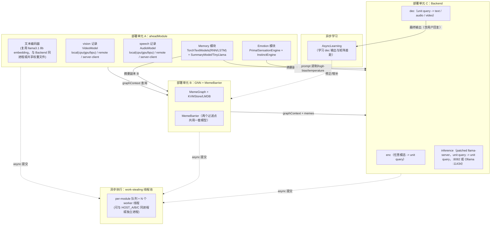
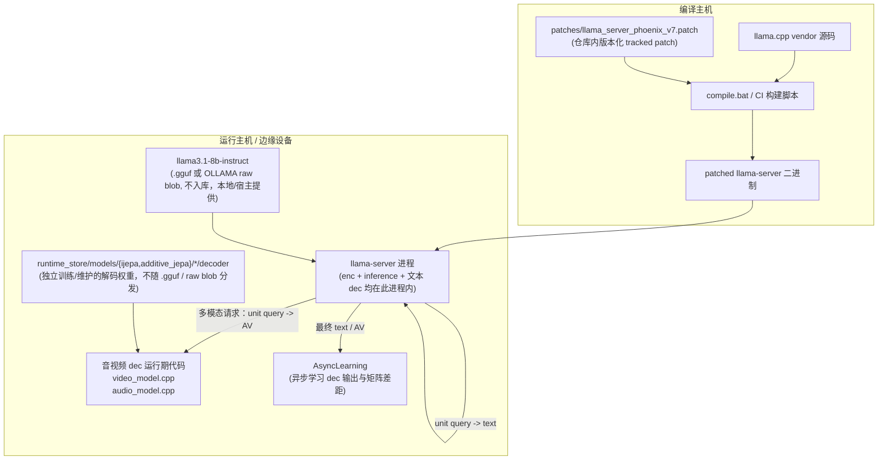

# v7.0 Model Deployment Topology

Phoenix v7.0 ("Arthur") can place the three heavy models (LLM, vision, speech)
on the same host or on separate edge devices.  The placement is decided at
process startup through command-line arguments, environment variables, or a JSON
configuration file.

> **命名说明**：本文档中的 "aheadModule" 指 GNN 之前负责多模态编码、记忆摘要与情感感知的**概念层**（详见 `workflow.md` 文件头与 §0），不是 `frontend_server.cpp`。`aheadModule` 在部署上对应 `vision`/`speech` 世界模型记录 + 文本编码器 + `Memory`/`Emotion` 子系统的组合部署，见 §0（新增）。

## 0. v7.0 目标部署拓扑总览（aheadModule / Memory / Emotion / GNN / MemeBarrier / Backend）



**部署原则**：

- 三个部署单元（aheadModule、GNN+MemeBarrier、Backend）可以合并到单机（默认 all-local 场景，见下文“Typical Scenarios”），也可以分布到不同主机/边缘设备，复用现有 `--<model>-placement local|remote|auto|server-client` 机制。
- `Memory`、`Emotion` 目前没有独立的 `ModelDeploymentRecord`；它们运行在 aheadModule 所在的进程/主机内，随 `vision`/`speech`/`llm` 之一的宿主机部署（不需要单独的远程协议），因为它们是轻量级、低延迟的本地状态机，不适合像 vision/speech 那样跨网络调用。
- work-stealing 线程池（§0.6 in `workflow.md`）默认与调用方同进程运行，各模块队列共享同一组 OS 线程；若某模块（如 Backend `inference`）被部署为独立进程/主机，则该模块的队列与线程池实例也随之独立部署，模块间通过现有的 HTTP/JSON 远程协议（见下文）通信，异步性由本地线程池 + 非阻塞 HTTP 调用共同保证。

## Concepts

- **Local**: the model is loaded in the Phoenix process or on the same machine.
  The exact local backend is selected by `localBackend`:
  - `cpu` — x86_64 / general-purpose CPU; runs the additive residual ONNX model
    via `tools/local_onnx_runner.py` (ONNX Runtime).
  - `gpu` — local GPU (CUDA, ROCm, etc.); same ONNX path with the GPU provider.
  - `bpu` — RDK X5 BPU; loads the compiled Horizon `.bin` with `rdk_x5_bpu::execute`.
  - `js` — browser / client-side JS runner (server-client mode).
  - `auto` — the factory picks `bpu` on `aarch64`, `cpu` on `x86_64`, and `cpu`
    otherwise.
- **Remote**: the model is served by another host and called over HTTP.
- **Auto**: lets the model factory choose the backend.  If a remote URL is
  configured the factory uses that remote endpoint; otherwise it falls back to
  the local backend.  The local backend is fail-closed: if the required model
  files (`.onnx`, `.bin`) or runtime are missing, the model returns an empty
  result and a clear error instead of a deterministic statistical fallback.
- **ServerClient** (web-only): the client (browser, mobile app, etc.) runs the
  pre-processing and the model itself.  The client sends pre-computed concept
  vectors to the Phoenix backend, which never runs the vision/speech model.

Each of the three model types has its own record:

- `llm`  - text generation (Ollama, llama.cpp server, BitNet server).
- `vision` - image world model (JEPA / I-JEPA style encoder).
- `speech` - audio / 1D world model.

In addition, **TinyLlama** is an auxiliary text backend (default port `:8086`) used
for short-summary generation and lightweight text tasks (e.g. `chatWithTinyllama`,
`SummaryModel`, `model/explain`).  It is configured through the `tinyllama.*`
config group / environment variables and is independent of the main `llm`
deployment record.

## Configuration Sources (precedence high to low)

1. Command-line arguments: `--llm-placement`, `--llm-remote-url`, ...
2. Environment variables: `AI_LLM_PLACEMENT`, `AI_LLM_REMOTE_URL`, ...
3. A JSON file passed with `--model-deployment-config`.

`loadConfig` first applies the existing legacy `transformer-mode`,
`ollama-base-url`, `ollama-model` and related flags, then overwrites those
fields with any remote LLM record defined in the deployment config.  This
means the deployment config takes precedence when it is present.

## Command-line Arguments

### Common pattern

```
--<model>-placement local|remote|auto|server-client
--<model>-local-backend cpu|gpu|bpu|js|auto
--<model>-remote-url <http://host:port/path>
--<model>-remote-method <calling method>
--<model>-remote-model <model name>
--<model>-remote-token <bearer token>
--<model>-remote-timeout-ms <milliseconds>
```

`<model>` is one of `llm`, `vision`, `speech`.

### LLM

- `--llm-placement remote`
- `--llm-remote-url http://192.168.1.10:11434`
- `--llm-remote-method ollama`       (also: `llamacpp`, `bitnet`)
- `--llm-remote-model llama3.1:8b`
- `--llm-remote-timeout-ms 120000`

### Vision

- `--vision-placement remote`
- `--vision-remote-url http://192.168.1.11:5000/infer`
- `--vision-remote-method http-json`
- `--vision-remote-timeout-ms 30000`

### Speech

- `--speech-placement remote`
- `--speech-remote-url http://192.168.1.12:5001/infer`
- `--speech-remote-method http-json`
- `--speech-remote-timeout-ms 30000`

## Environment Variables

Same names as the CLI arguments, uppercased and underscored:

```
AI_LLM_PLACEMENT=remote
AI_LLM_REMOTE_URL=http://192.168.1.10:11434
AI_LLM_REMOTE_METHOD=ollama
AI_LLM_REMOTE_MODEL=llama3.1:8b

AI_VISION_PLACEMENT=remote
AI_VISION_LOCAL_BACKEND=cpu
AI_VISION_REMOTE_URL=http://192.168.1.11:5000/infer

AI_SPEECH_PLACEMENT=remote
AI_SPEECH_LOCAL_BACKEND=cpu
AI_SPEECH_REMOTE_URL=http://192.168.1.12:5001/infer

AI_MODEL_DEPLOYMENT_CONFIG=config/model_deployment.json
```

## JSON Configuration File

A file can be passed with `--model-deployment-config config/model_deployment.json`
or `AI_MODEL_DEPLOYMENT_CONFIG`.

```json
{
  "llm": {
    "placement": "remote",
    "remote": {
      "url": "http://192.168.1.10:11434",
      "method": "ollama",
      "modelName": "llama3.1:8b",
      "timeoutMs": 120000
    }
  },
  "vision": {
    "placement": "remote",
    "localBackend": "cpu",
    "remote": {
      "url": "http://192.168.1.11:5000/infer",
      "method": "http-json",
      "timeoutMs": 30000
    }
  },
  "speech": {
    "placement": "remote",
    "localBackend": "cpu",
    "remote": {
      "url": "http://192.168.1.12:5001/infer",
      "method": "http-json",
      "timeoutMs": 30000
    }
  }
}
```

## Typical Scenarios

### 1. All local (default)

No extra arguments.  Phoenix uses `transformer-mode` as before and local vision /
speech backends.  On x86_64 the default local backend is `cpu` (ONNX Runtime
through `tools/local_onnx_runner.py`); on RDK X5 it is `bpu`.

### 2. Host LLM, edge vision + speech

```bash
phoenix_main.exe \
  --transformer-mode ollama \
  --llm-placement local \
  --vision-placement remote --vision-remote-url http://192.168.1.11:5000/infer \
  --speech-placement remote --speech-remote-url http://192.168.1.12:5001/infer
```

### 3. Edge LLM, edge vision, edge speech

```bash
phoenix_main.exe \
  --llm-placement remote --llm-remote-url http://192.168.1.10:11434 --llm-remote-method ollama --llm-remote-model llama3.1:8b \
  --vision-placement remote --vision-remote-url http://192.168.1.11:5000/infer \
  --speech-placement remote --speech-remote-url http://192.168.1.12:5001/infer
```

### 4. Mixed: three devices, one model per device

```bash
phoenix_main.exe \
  --model-deployment-config config/model_deployment.json
```

with the JSON above.

### 5. Auto placement with edge fallback

```bash
python tools/generate_model_deployment_config.py \
  --llm auto --llm-url http://192.168.1.10:11434 --llm-method ollama --llm-model llama3.1:8b \
  --vision auto --vision-url http://192.168.1.11:5000/infer \
  --speech auto --speech-url http://192.168.1.12:5001/infer \
  -o config/model_deployment.json

phoenix_main.exe --model-deployment-config config/model_deployment.json
```

With `auto`, Phoenix will use the configured remote URL when it is present.  If the
remote is unreachable the factories fall back to the local backend chosen by
`localBackend`.  The local backend is fail-closed: if the required `.onnx`/`.bin`
model or runtime is missing, the factory returns an unavailable model that reports
an error in `status()` and produces empty vectors, instead of a deterministic
statistical fallback.

### 6. Server-client architecture

In this mode the client (browser / edge UI) runs the vision and/or speech
pre-processing and model, and sends pre-computed concept vectors to the Phoenix
backend.  The backend is typically a single powerful LLM host or cluster.

```bash
python tools/generate_model_deployment_matrix.py --non-interactive \
  --current-role host --gateway-role host --target-arch x86_64 \
  --llm-placement local --vision-placement server-client --speech-placement server-client

phoenix_main.exe --model-deployment-config config/model_deployment.json
```

Set `vision` and/or `speech` placement to `server-client` so the factories return
a passthrough model that expects client-supplied concept vectors.  Encode/decode
calls in the backend are rejected with a clear error (`server-client mode expects
a client-supplied concept vector`).  For client-side execution see
`static/js/client_onnx_runner.js`.

### 7. TinyLlama auxiliary backend

TinyLlama runs as a sidecar `llama-server` (default `http://127.0.0.1:8086`) and is
used for short-summary generation, `model/explain`, and other lightweight text
tasks.  It does not replace the main LLM.

Configuration keys (all may be overridden by environment variables):

```
tinyllama.baseUrl      default: http://127.0.0.1:8086
tinyllama.timeoutMs    default: 5000
summary_model.useTinyllama  default: true
summary_model.maxTokens     default: 32
```

Environment variables:

```
AI_TINYLLAMA_BASE_URL=http://127.0.0.1:8086
AI_TINYLLAMA_TIMEOUT_MS=5000
FRONTEND_SUMMARY_USE_TINYLLAMA=true
FRONTEND_SUMMARY_MAX_TOKENS=32
```

`frontend_server.cpp` uses `drogon::HttpClient` with a `std::future` timeout to call
TinyLlama `/api/chat`; if the call fails or times out, the summary falls back to the
top-k keyword cloud.  The gateway `chatWithTinyllama` is also used between GNN
selection and the main LLM call to enrich the prompt.

## Remote HTTP/JSON Protocol for Vision and Speech

When `method` is `http-json`, Phoenix `POST`s a JSON body to the configured URL.

### Vision request

```json
{
  "modality": "image",
  "mimeType": "image/png",
  "width": 224,
  "height": 224,
  "payloadBase64": "...",
  "conceptDim": 128
}
```

### Vision response

```json
{
  "ok": true,
  "embedding": [0.12, -0.34, ...]
}
```

### Speech request

```json
{
  "modality": "audio",
  "mimeType": "audio/wav",
  "sampleRate": 16000,
  "payloadBase64": "...",
  "conceptDim": 128
}
```

### Speech response

```json
{
  "ok": true,
  "embedding": [0.05, 0.78, ...]
}
```

### Decode request

A decode request is sent when Phoenix needs to convert a concept vector back to
raw bytes (e.g. image or audio synthesis).  It contains the floating-point
concept vector produced by the encode step and an optional `lengthHint` for
audio:

```json
{
  "modality": "image",
  "decode": true,
  "mimeType": "image/png",
  "conceptVector": [0.12, -0.34, ...]
}
```

```json
{
  "modality": "audio",
  "decode": true,
  "mimeType": "audio/pcm",
  "lengthHint": 16000,
  "conceptVector": [0.05, 0.78, ...]
}
```

### Decode response

```json
{
  "ok": true,
  "modality": "image",
  "mimeType": "image/png",
  "payloadBase64": "..."
}
```

On failure the remote service should return `{"ok":false,"error":"..."}`.

## Helper Tools

- `tools/generate_model_deployment_config.py` — writes a JSON deployment config
  from command-line arguments.
- `tools/generate_model_deployment_matrix.py` — interactive generator for the
  full 649-endpoint deployment space.  Hardcodes the option lists, asks for the
  current machine, external gateway, target architecture, per-modality placement,
  and connection type, then writes `config/model_deployment.json` and
  `compile_env_model_deployment.bat`.
- `tools/model_deployment_edge_example.py` — a minimal Python HTTP/JSON edge
  inference server that returns deterministic embeddings and decode payloads for
  vision/speech.  Replace the stub embedding/synthesis with a real model on the
  edge device.
- `tools/train_bpu_jepa_head.py` — trains the 1x1 Conv2d concept head on the
  frozen BPU encoder (`model_encoder.onnx`) using a VICReg-style loss.  Output
  is a new `model_encoder_head.onnx` and an updated `model.manifest.json`.
- `tools/local_onnx_runner.py` — one-shot ONNX Runtime runner used by the x86_64
  `cpu`/`gpu` local backend.  It reads a float32 binary input, runs the model,
  and writes a float32 binary output.
- `tools/additive_jepa.py` — builds additive residual speech/vision encoders and
  decoders and exports them to `best.pt/.onnx/.bin` under
  `runtime_store/models/additive_jepa/{speech,vision}_{encoder,decoder}/`.
- `static/js/client_onnx_runner.js` — browser-side JS runner stub for
  server-client mode.

```bash
# Generate a three-device config
python tools/generate_model_deployment_config.py \
  --llm remote --llm-url http://192.168.1.10:11434 --llm-method ollama --llm-model llama3.1:8b \
  --vision remote --vision-url http://192.168.1.11:5000/infer \
  --speech remote --speech-url http://192.168.1.12:5001/infer \
  -o config/model_deployment.json

# Start the example edge server for vision/speech on the edge devices
python tools/model_deployment_edge_example.py --port 5000
python tools/model_deployment_edge_example.py --port 5001
```

## Compile-Time Edge Device Selection

Phoenix also supports conditional compilation for the edge image and speech
backends.  This is useful when building a binary that should never use the RDK X5
BPU or remote vision/speech endpoints (for example, a pure text/robotics build
on a machine without the Horizon SDK).

Set these environment variables before running `compile.bat` or `compile_gtest.bat`:

```powershell
# Disable both edge image (BPU + remote) and edge speech (remote)
$env:PHOENIX_DISABLE_EDGE_IMAGE = "1"
$env:PHOENIX_DISABLE_EDGE_SPEECH = "1"
compile.bat
```

| Macro | Default | When set to `0` at compile time |
|---|---|---|
| `PHOENIX_EDGE_IMAGE_ENABLED` | `1` | `rdk_x5_bpu.cpp` does not include or link `dnn/hb_dnn.h`; `createVideoModel()` cannot select the BPU backend and falls through to the configured `localBackend`. |
| `PHOENIX_EDGE_SPEECH_ENABLED` | `1` | `createAudioModel()` cannot select the BPU backend and falls through to the configured `localBackend`. |

The defaults keep the existing v7.0 behavior (BPU/local and remote endpoints are
enabled and selected by runtime deployment configuration).

## Implementation Notes

- `model_deployment.{hpp,cpp}` defines the topology, parses configuration and
  provides `RemoteModelClient` for synchronous HTTP calls.  v7.0 adds
  `LocalBackendType` (`cpu`/`gpu`/`bpu`/`js`/`auto`) to `ModelDeploymentRecord`.
- `video_model.cpp` and `audio_model.cpp` query
  `ModelDeploymentConfig::instance()` in their factories and create a remote,
  server-client, BPU, local ONNX, or unavailable model as appropriate.  No
  deterministic statistical fallback is returned.
- Additive residual models are loaded from
  `runtime_store/models/additive_jepa/{speech,vision}_{encoder,decoder}/best.onnx`
  (x86_64 `cpu`/`gpu`) or `best.bin` (RDK X5 `bpu`).
- Legacy `runtime_store/models/ijepa/<variant>/` BPU `.bin` files are still
  supported as a fallback path resolution.
- When a model is not ready the factory returns a `*UnavailableModel` whose
  `status()` contains `"ready": false` and an `error` message; encode/decode
  return empty vectors and the mixed-modal bridge sets `videoEncoderError` /
  `videoDecodeError` / `audioDecodeError` metadata.
- `loadConfig` first applies the legacy `transformer-mode` and Ollama /
  llama.cpp / BitNet flags, then overwrites the corresponding `Config` fields
  (`ollamaBaseUrl`, `llamaCppBaseUrl`, `bitnetBaseUrl`, model names and
  timeouts) with any remote LLM record from the deployment config.  The
  existing `chatWithOllama` / `chatWithLlamaCpp` / `chatWithBitNet` functions
  therefore receive the final, merged configuration.

---

## 8. Backend 三段（enc / inference / dec）的部署形态（v7.0 目标）

对应 `workflow.md` §0.4/§15、`algorithm.md` §14。



**部署要点**：

1. `patches/llama_server_phoenix_v7.patch`（目标路径，命名可在实现时调整）应作为仓库内**版本化文件**提交，编译脚本（`compile.bat` 或未来的 CI 流程）在拉取/更新 `llama.cpp` vendor 源码之后、构建 `llama-server` 目标之前应用该 patch，使 `enc`/`inference`/`dec` 需要的钩子（emotion 的 prompt/logit-bias 接口、可选的预计算 embedding 输入接口）在编译期就已经存在于二进制中，而不是运行时反射/hook。
2. 文本 LLM 的 `.gguf` 模型文件或 OLLAMA raw blob 本身**不提交到仓库**（体积/许可原因），运行主机需要自行放置到约定路径（沿用现有 `llm.local`/`llm.remote` 部署记录机制）。
3. 音视频 `dec` **不能**依赖 `.gguf` / raw blob：其解码权重来自 `runtime_store/models/ijepa/<variant>/model.safetensors`（图像）或 `runtime_store/models/additive_jepa/{speech,vision}_decoder/best.{onnx,bin}`（语音/加法残差模型），这些文件同样不入库，需要通过 `tools/additive_jepa.py`、远程训练脚本等渠道单独产出并放置到运行主机，因此音视频 `dec` 在部署清单上要与文本 `dec`（随 llama-server 二进制自带）分开登记、分开校验是否就绪（复用现有 `status()`/`ready` 语义）。
4. 若 Backend 被拆到独立主机（例如 `llm.placement=remote`），`enc`/`inference`/`dec` 三段仍然一起运行在该主机的 `llama-server` 进程内（拆分是逻辑边界，不是跨主机边界）；只有音视频 `dec` 可以选择性地部署为该主机上的旁挂进程/库调用。
5. `enc`/`inference`/`dec` 之间的数据单元是 **unit query**（隐藏状态/概念向量），`text / audio / video` 只在 `enc` 之前与 `dec` 之后出现。`dec` 的输出应交给 `AsyncLearning`（异步学习模块），由其检测与当前知识/情感矩阵的差距，并异步修正或增补矩阵；`dec` 输出不回传给 `inference`。
6. 当前 8B 文本模型是自回归 token-based 模型，因此每步 `dec` 输出的 token 会被临时 `enc` 回 unit query 以继续生成。`llama-server` 通过 `POST /phx/generate` 把这段循环封装在服务端，客户端在 `apply-template` 后直接调用 `/phx/generate` 即可获得最终文本。这是**文本模型在当前阶段的实现折中**，不是概念流；概念上 `inference` 仍是 unit query -> unit query，`dec` 仍是最终模态输出边界。

## 9. Emotion / Memory 模块的部署形态

Emotion（`PrimalSensationEngine` + `InstinctEngine`）与 Memory（`TorchTextModels` RNN/LSTM + `SummaryModel`/TinyLlama）目前**没有**独立的 `ModelDeploymentRecord`，原因：

- 二者都是轻量、低延迟、强状态依赖（会话内本能激活度、上下文摘要）的模块，跨网络部署会引入不必要的延迟与状态同步复杂度。
- Emotion 的输出（prompt 片段、logit-bias、temperature）需要在每次生成请求前实时提供给 Backend，因此建议与调用 Backend 的进程同机部署（可以和 aheadModule 同进程，也可以和 Backend 同进程，取决于哪一侧延迟更敏感）。
- Memory 的两个下游分支（Backend / GNN+MemeBarrier）已经允许跨进程/跨主机（通过现有 HTTP 接口），Memory 本身的摘要计算仍建议留在 aheadModule 所在主机，避免摘要源数据（原始多模态 payload）跨网络传输。

TinyLlama 子进程部署方式沿用第 7 节现状（sidecar `llama-server`，默认 `:8086`），是 Memory 模块 Transformer 摘要分支的具体落地；RNN/LSTM 分支（`TorchTextModels`）保持进程内加载，不需要网络部署。

## 10. 异步任务系统（work-stealing 线程池）的部署与配置

对应 `workflow.md` §0.6/§16、`algorithm.md` §16。目标配置项（规划中，实际 key 名以实现时的 `config/phoenix.json` schema 为准）：

```json
{
  "async_pool": {
    "workerThreads": "auto",        
    "parkMaxMs": 50,
    "maxBacklog": {
      "meme_barrier": 2000,
      "backend": 500,
      "gnn": 2000,
      "ahead_module": 2000,
      "output_decoder": 500,
      "async_sidecar": 20000
    },
    "priorities": {
      "meme_barrier": 0,
      "backend": 1,
      "gnn": 1,
      "ahead_module": 2,
      "output_decoder": 2,
      "async_sidecar": 3
    }
  }
}
```

- `workerThreads: "auto"` 建议取 `min(物理核心数, 8)`，与 Drogon 自身的 IO 线程池、`ControllerPool` 共享物理核心预算，避免线程数超订导致上下文切换开销。
- 单机部署时，所有模块队列位于同一进程、同一线程池；分布式部署时，每个独立部署的模块（如远程 vision/speech、远程/edge Backend）拥有各自独立的线程池实例，模块间仍通过现有 HTTP/JSON 协议通信，跨进程不做“偷取”，只在进程内部做 work-stealing。
- 边缘设备（RDK X5 / MCU）因核心数与内存有限，建议将 `async_sidecar`（学习/工具/持久化）队列的 `maxBacklog` 调小，或直接关闭在边缘设备上运行在线学习任务，把该队列迁移到主机侧（沿用现有“Host LLM, edge vision+speech”等部署场景）。

## 11. 音频/视频解码器部署

音视频输出解码器对应 `workflow.md` 总览图中的 "音频/视频解码器（需要时）"：

- 图像/视频：`video_model.cpp` 的 `decode()`，依赖 `runtime_store/models/ijepa/<variant>/model.safetensors` 或 `additive_jepa` 的 `vision_decoder/best.{onnx,bin}`，可运行在 `local(cpu/gpu/bpu)`、`remote`、`server-client` 任一部署模式（复用第 2/3 节的通用参数）。
- 音频：`audio_model.cpp` 的 `decode()`，依赖 `speech_decoder/best.{onnx,bin}`，部署模式同上。
- 两者都遵循"fail-closed"原则：解码权重缺失时返回明确错误而不是确定性占位输出（沿用第 5 节 "Auto placement with edge fallback" 的既有约定）。
- 当输出目标是纯文本时，输出队列直接跳过音视频解码器，对应 `workflow.md` §0.1 图中 `OQ0 -->|纯文本无需解码| USER0` 分支。
