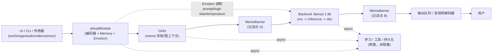

# v7.0升级方向

## 0. 目标架构总览（与 workflow.md / algorithm.md / model_deployment.md 对齐）

> 本节是 v7.0 目标架构的**总纲摘要**，详细数据流见 `workflow.md` §0，算法细节见 `algorithm.md` §13-16，部署形态见 `model_deployment.md` §0/8-11。命名约定：GNN 之前的多模态编码/记忆/情感前置模块统一称为 **`aheadModule`**，不使用 `frontend_Server` 这一名字（`frontend_server.cpp` 仅是 HTTP 反向代理进程，与 `aheadModule` 是两个不同的概念）。

核心设计要点（逐条对应本文件后续章节与其它三份文档）：

1. **输入模态**：文本、图像、音频、视频、传感器统一进入 `aheadModule`；音频/视频的编码器由 `aheadModule` 内部实现（对应 `AudioModel`/`VideoModel`），文本编码器可直接复用 `llama3.1 8b` 自带的 embedding/encoder 部分，不必单独训练 —— 呼应 §I.1 "以目前 llama3.1:8b 的维度数为准，不希望大规模调整"。
2. **记忆模块（Memory）**：RNN/LSTM/Transformer 摘要，产生的摘要有**并行双分支**：一路进 Backend，一路进 GNN/MemeBarrier；句子生成模块（如 TinyLlama）产出的文本同样是并行双副本（给 Backend 与给 MemeBarrier），二者不是串行流水线。细节见 `workflow.md` §0.1/§2.1、`algorithm.md` §13。
3. **情感（Emotion/Sentiment）**：情感观测"输入+内部状态"，sentiment/aheadModule 对其调制；情感对 Backend 的影响走三条有文献依据的通道——prompt 调制、logit bias、temperature 调节——而**不是**对 Backend 权重矩阵做原始小矩阵乘法。这是对 §II.3 "情感层通过固定线性操作矩阵映射为 8 维权值，作为下游矩阵操作的潜在信号"描述的具体落地方式（driveVector 仍然是情感状态的内部表示，只是不再假设它直接乘进权重矩阵，而是转成这三种可控生成接口）。细节见 `workflow.md` §0.5、`algorithm.md` §15。
4. **MemeBarrier**：安全/语义过滤器，出现在两处——GNN 与用户/下游之间，以及 Backend 输出与用户之间。细节见 `workflow.md` §0.3。
5. **GNN**：存取语义单元（meme）并提供图上下文，延续 §I.1 "语义单元"设计。
6. **Backend**：`llama3.1 8b` 在编译期/运行期拆分为 `enc`（token embedding/输入投影）、`inference`（打了 tracked patch 的 llama-server 主体）、`dec`（LM head/输出投影；音视频 `dec` 因 `.gguf` / OLLAMA raw blob 不包含相应权重、且不入库，改由运行期 C++ 代码实现）。细节见 `workflow.md` §0.4/§15、`algorithm.md` §14、`model_deployment.md` §8。
7. **异步执行**：不使用中心事件循环，改为按模块的优先级任务队列 + work-stealing 线程池，兼顾故障隔离与优先级差异化调度。细节见 `workflow.md` §0.6/§16、`algorithm.md` §16、`model_deployment.md` §10。

以上①-⑦为本次文档更新新增的目标架构描述；下文原有的 I-IV 章节（问题定义、多模态真连接、原生感受/野性/趋利避害、Prompt 双分、外部 IO 模块等）作为其历史设计背景与已实现基础保留，并未被取代——`aheadModule` 正是对其中"多模态真连接架构""外部 io 模块""原生感受与情感"等既有设计的统一再命名与流程串联。

---

1.v7.0对外命名为Arthur
同时规定后续命名方式，从8.0开始分别为Lancelot gawain Galahad Percival Ganis Tristan Gareth Bedivere Kay Gaheris Lamorak 
2.目前的v6.0版本的问题主要出现在以下方面：
i:各个多模态中间虽然是直接通过张量连接的(存疑)，但是没有真正的实现连接，只能实现的是各个模态中间的相互转换。也就是说，我们正在默认基础的存储单元为一词元
ii:对长期的自主生存能力提升不强。目前的情况下，之前的文档中应该有类似于信条一类的机制，但是没有实施。这对应于实际的生命实际为趋利避害的特性。所以，我们需要先定义痛苦等原生感受，与其从情感相区分，然后再定义野性，最终将其与情感等相连接。
从而定义趋利避害，使ai不需要人的主动分步骤控制，而是可以直接从头干到尾。
这样，prompt就被自然而然的划分为两个部分，一部分为ai自己给予自己的，为记忆。另一部分为初始的定义于程序运行之初的，就是真正的prompt
这样，ai将真正具备长期运行能力
iii.测试相对不足，可能存在由于测试覆盖率不高导致的隐形错误的出现。至少要达到单元测试应大约密度在100个单元测试/函数的量级上，其中至少应该有15个为刻意的渗透测试，15个为错误输入
iv.注释不足，目前仍然无法实现全部.cpp文件的自文档化

## I.底层增强
### I.1 多模态真连接架构
- 内容要点:
  - 重新定义基础存储单元，从词元扩展为"语义单元"(Semantic Unit)
  - 实现跨模态张量的直接计算与融合，而非仅转换
  - 设计统一的多模态嵌入空间
- 详细规格:
  - 语义单元结构: 包含模态标识符、语义向量、时间戳、置信度、关联指针
  - 跨模态融合算子: 定义加法融合、乘法融合、注意力融合三种基础算子
  - 以目前llama3.1:8b的维度数为准，我们不希望大规模的调整，我们的算力不足
  - 模态类型枚举: 文本、图像、音频、视频、传感器、结构化数据
  - 损失函数: 对比损失 + 重建损失 + 语义一致性损失的加权组合
  - 张量连接验证: 通过跨模态检索任务验证真连接有效性
##### 注意，这需要将其能够在不改变目前大模型的情况下相当于加上一部分，或者补全一部分，从而减小重训的开销，而非直接的多对多映射(那样又相当于直接的以词元作为基底了)
##### 同时需要能够让 .gguf / OLLAMA raw blob 模型能够动态改变，从而适配对外部在软件生命周期中的学习(注意，需要有备份以允许多次启动)

### I.2 测试覆盖率提升 (对应问题iii)
- 内容要点:
  - 目标: 100个单元测试/函数
  - 渗透测试: 至少15个/函数 (安全边界、注入攻击、资源耗尽)
  - 错误输入测试: 至少15个/函数 (空值、越界、类型错误、畸形数据)
  - 测试框架: 基于gtest/1.14.0扩展
  - 自动化覆盖率报告生成
- 详细规格:
  - 渗透测试类别:
    - 缓冲区溢出测试 (3个/函数)
    - SQL/命令注入测试 (3个/函数)
    - 内存泄漏检测 (2个/函数)
    - 竞态条件测试 (2个/函数)
    - 资源耗尽测试 (2个/函数)
    - 权限绕过测试 (2个/函数)
    - 加密弱点测试 (1个/函数)
  - 错误输入测试类别:
    - 空值/nullptr测试 (3个/函数)
    - 边界值测试 (3个/函数)
    - 类型错误测试 (3个/函数)
    - 畸形数据测试 (3个/函数)
    - 超大输入测试 (2个/函数)
    - 编码错误测试 (1个/函数)
  - 常规功能测试: 剩余70个/函数覆盖正常路径与边缘情况
  - 覆盖率目标: 行覆盖率≥95%, 分支覆盖率≥90%, 函数覆盖率100%

### I.3 代码自文档化 (对应问题iv)
- 内容要点:
  - 所有.cpp文件必须包含文件头注释、函数注释、关键逻辑注释
  - 引入Doxygen格式标准
  - 同时维持目前的gnu标准不变，向上添加而非替换
  - 注释覆盖率目标: 100%公开接口, 80%内部实现
- 详细规格:
  - 文件头注释模板:
    - 文件名、作者、创建日期、最后修改日期
    - 文件用途简述 (不超过3行)
    - 依赖模块列表
    - 版权声明
  - 函数注释模板 (Doxygen格式):
    - @brief: 一句话描述功能
    - @param: 每个参数的名称、类型、用途、有效范围
    - @return: 返回值类型与含义
    - @throws: 可能抛出的异常
    - @note: 特殊注意事项
    - @example: 使用示例 (复杂函数必需)
  - 关键逻辑注释规则:
    - 循环体超过10行必须注释目的
    - 条件分支超过3个必须注释逻辑
    - 魔数必须注释来源或计算方式
    - 算法实现必须注释复杂度与参考文献

## II.情感层面增强 (对应问题ii)
### II.1 原生感受定义
- 注意，这相当于人的脑干左右的地区
- 内容要点:
  - 定义原生感受(Primal Sensation): 参考目前已有的生物学论文(从arxiv上查找)以确定人应该有的内容
  - 与情感(Emotion)的区分: 原生感受为底层信号，情感为高层解释
  - 原生感受的数值化表示与阈值机制
  - 感受信号的传播路径
- 详细规格待定

### II.2 野性定义
- 内容要点:
  - 定义野性(Instinct)为无需学习的先天行为倾向
  - 野性类型: 参考目前已有的生物学论文(从arxiv上查找)以确定人应该有的内容
  - 野性与原生感受的绑定关系
  - 野性强度的动态调节机制
- 详细规格:
  - 野性类型与定义（已实现于 `instinct.hpp` 的 `InstinctType`）：
    - 生存本能(Survival): 维持系统运行、保护核心功能
    - 探索本能(Exploration): 主动获取新信息、扩展能力边界
    - 回避本能(Avoidance): 远离已知危险、减少不确定性
    - 亲和本能(Affiliation): 寻求交互、建立连接（对应社交需求）
    - 好奇本能(Curiosity): 解决不确定性、深入探索（对应成就/满足驱动）
  - 野性与原生感受的绑定:
    - 痛苦 → 回避本能激活
    - 饥饿/新颖 → 探索/好奇本能激活
    - 疲劳/威胁 → 生存本能激活（休息/保护倾向）
    - 满足 → 好奇本能强化（继续探索）
    - 舒适/社交隔离 → 亲和本能激活（建立连接）
  - 野性强度参数化:
    - 基础强度: 初始化时设定的默认值 [0.0, 1.0]
    - 当前强度: 受原生感受调节的实时值
    - 衰减系数: 野性满足后的强度下降速率
    - 累积系数: 野性未满足时的强度上升速率
  - 动态调节机制（已实现于 `InstinctEngine::update()`）：
    - 公式：当前强度 = 基础强度 × (1 + 原生感受匹配分) × 时间衰减因子
    - 时间衰减因子按半衰期 `activationDecayHalfLife_`（默认 60 秒）指数衰减
    - `evaluate()` 与 `evaluateAction()` 使用当前强度计算 benefit/harm
    - `CognitionAutonomyManager::iterate()` 每次循环前调用 `update()` 更新当前强度
    - 多野性冲突时按当前强度排序，取最强者主导
  - 注意，野性对ai的影响因子类似于情感，但同样的需要通过实验确定，其影响的强度更大，但是精细化程度更小，不应该对应到单元

### II.3 趋利避害机制
- 内容要点:
  - 将原生感受、野性、情感三层连接
  - 定义"利"与"害"的量化标准
  - 实现自主决策链: 感受→野性→情感→行动
  - 消除人工分步控制依赖
- 详细规格:
  - 三层连接架构:
    - 第一层(原生感受): 实时监控系统状态，生成底层信号
    - 第二层(野性): 将感受信号转化为行为倾向
    - 第三层(情感): 对行为倾向进行认知加工，生成决策
  - "利"的量化标准:
    - 任务完成度提升 (+权重)
    - 知识库扩展 (+权重)
    - 资源获取 (+权重)
    - 用户满意度提升 (+权重)
    - 系统稳定性维持 (+权重)
  - "害"的量化标准:
    - 任务失败 (-权重)
    - 资源消耗过度 (-权重)
    - 约束违反 (-权重)
    - 用户不满 (-权重)
    - 系统异常 (-权重)
  - 自主决策链实现:
    - 输入: 环境状态 + 任务目标
    - 感受层: 评估当前状态，生成感受向量
    - 野性层: 根据感受激活相应本能，生成行为倾向权重
    - 情感层: 将行为倾向通过固定线性操作矩阵映射为8维权值，作为下游矩阵(如词表权重表/logit-bias)的潜在信号，而非直接输出为具体情绪或行为词语
    - 输出: 选择利害比最优的行动执行
  - 消除人工控制:
    - 仅需提供初始目标，AI自主分解子任务
    - 遇到障碍自主调整策略
    - 完成后自主报告结果

### II.4 Prompt双分架构
- 内容要点:
  - 系统Prompt: 程序运行之初定义，不可变
  - 记忆Prompt: AI自我生成，动态累积
  - 注意，记忆prompt即现在的frontend_server.cpp中的记忆模块
  - 两类Prompt的优先级与冲突解决机制(参考趋利避害)
  - 长期运行下的记忆管理与遗忘策略(该部分需要增强已有的记忆模块，而非新建)

## III. 认知与行动层
### III.1 Prompt双分实现
- 实现位置: `prompt_split.{hpp,cpp}`
- `SystemPrompt` 保存不可变的身份、版本、约束、核心指令
- `MemoryPrompt` 保存由 `PromptComposer` 动态生成的摘要、相关事实、目标、情感基调(保留字段)、趋利避害偏向; 其中趋利避害偏向不再硬编码为"approach/avoid/wait"等行为词语，而是直接使用 `BenefitHarmResult.driveVector` 的数值权值，作为下游矩阵操作的潜在信号
- `PromptComposer::compose()` 组合系统提示 + 记忆提示 + 用户提示
- `PromptComposer::composeMessages()` 输出 JSON chat 消息结构
- `PromptComposer::fromContext()` / `fromSemanticMemory()` 支持从上下文/语义记忆生成记忆提示

### III.2 外部混合模态 I/O
- 实现位置: `external_mixed_modal_io.{hpp,cpp}`
- `MixedModalPacket` 表示一条带有 id、modality、payload、mimeType、source、timestampMs、metadata 的输入/输出包
- `MixedModalInputBuffer` / `MixedModalOutputQueue` 提供线程安全的入队/出队
- `MixedModalChannelRegistry` 管理命名外部通道
- `MixedModalPacket::toSemanticUnit()` 通过 `MixedModalConceptBridge` 转换为 `SemanticUnit`：文本进入 token-encoder 概念向量；图像/视频优先接收世界模型生成的 `worldModelVector`/`conceptVector`，否则只保留无文本的视觉特征向量；语音被视作一维视觉信号，并由可持久化的语音概念模型映射到同一空间
- `MixedModalConceptBridge::pretrainSpeech()` 使用“音频包 + 对应文本”预训练语音到文本概念空间的对齐向量，并持久化到 `runtime_store/speech_concept_model.json`；该模型不是运行时可变会话状态
- `MixedModalConceptBridge::decode()` 将抽象 `SemanticUnit` 适配为外部包：文本可直接形成 UTF-8 输出，其他模态输出概念载荷并标记 `requiresModalityDecoder`，由目标模态解码器实体化

### III.3 自主决策管理器
- 实现位置: `autonomy_stack.{hpp,cpp}` 的 `CognitionAutonomyManager`
- 持有 `PrimalSensationEngine`、`InstinctEngine`、`PromptComposer`、混合模态缓冲与通道注册表
- API: `observe()` / `iterate()` / `ingestSensation()` / `evaluateInstincts()` / `composePrompt()` / `ingestMixedModalPacket()` / `pretrainSpeechConcept()` / `emitMixedModalOutput()` / `drainMixedModalOutputs()`
- `iterate()` 在每次循环中重新评估趋利避害并更新记忆提示

## IV 基础设施
### IV.1 外部io模块
目前，如果使用的是混合多模态的情况下，那么unit就不能够直接的进行输出了，因为可能混杂了各种东西
所以，我们需要一套专门的系统进行输入输出。这一部分应该从目前的系统的基本io中抽离出来，于之前的llama-server模块分离
就像人如果要对外交互，要么用声音说话，要么用手写，从来不能直接通过脑电波就传出去(当然，ai可以保留这一功能，作为对其思维过程的体现)

## V. Backend 拆分、MemeBarrier 双过滤点与异步执行模型（v7.0 目标架构收尾）

本节呼应 §IV.1 提出的"外部 io 模块需要与 llama-server 模块分离"的诉求，给出具体拆分方式，并补齐 MemeBarrier 与异步执行两块此前未展开的设计。

### V.1 llama-server 的 enc / inference / dec 拆分

`llama3.1 8b` 在编译期/运行期被拆分为三段。三段之间的数据单元是 **unit query**（隐藏状态/语义向量）；`text / audio / video` 只在 `enc` 之前（输入）和 `dec` 之后（输出）出现：

- `enc`：任意模态 -> unit query。文本是 token embedding 查表，音视频是输入投影/编码器，可直接接受 `aheadModule` 产出的跨模态语义向量（避免多余的 tokenizer round-trip）。
- `inference`：unit query -> unit query。`llama-server` 主体，通过**仓库内版本化的 tracked patch** 在编译期打入，暴露逐层隐藏状态接口，供 Emotion 模块做 prompt 调制与 logit-bias/temperature 注入。`inference` 本身不直接生成 text/audio/video。
- `dec`：unit query -> 输出模态。文本场景复用 llama.cpp 的 LM head 产生 token 并 detokenize；音频/视频场景由于 `.gguf` / raw blob 本身不包含对应的解码权重、且这些权重不入库，`dec` 改为 Phoenix 运行期 C++ 代码实现（`video_model.cpp`/`audio_model.cpp` 的 `decode()`）。

`dec` 的输出不回传给 `inference`，而是返回给用户/下游，并同步（或异步）进入 `AsyncLearning` 学习模块，由它检测与当前知识/情感矩阵的差距并进行修正或增补。

针对当前 8B 文本模型的自回归实现：由于它是 token-based 模型，`dec` 每步只能先输出一个 token（文本），该 token 需要被 `enc` 重新编码为 unit query 后才能进入下一步 `infer`。`llama-server` 现在提供 `POST /phx/generate` 端点，把这段 enc/infer/dec 采样循环封装在服务端完成，客户端只需提供 prompt、调用 `apply-template` 后发给 `/phx/generate` 即可收到最终文本。这是**当前文本模型的实现折中**，不是概念流；概念上 `inference` 始终是 unit query -> unit query，`dec` 始终是最终模态输出边界。

这正是 §IV.1 所说"从基本 io 中抽离、与 llama-server 模块分离"的落地方式：`enc`/`dec` 是 io 边界，`inference` 是纯粹的语言模型计算核心。详见 `algorithm.md` §14、`model_deployment.md` §8、`workflow.md` §0.4。

### V.2 MemeBarrier 作为双过滤点

MemeBarrier 不再只是 GNN 侧的一次性"异常扫描"，而是显式定义为两个独立的过滤点：GNN 输出→用户/下游 prompt 之间的过滤点 A，以及 Backend `dec` 输出→用户之间的过滤点 B。两点复用同一套 TextCNN + RNN/LSTM 分类器/规则引擎，但分别独立评估，避免"一处放行即全局放行"的安全假设。详见 `workflow.md` §0.3。

### V.3 异步执行：per-module 优先级队列 + work-stealing 线程池

不采用中心事件循环，理由与设计见 `workflow.md` §0.6/§16、`algorithm.md` §16：每个模块（aheadModule、GNN、MemeBarrier、Backend、输出解码器、异步旁路）拥有独立的优先级任务队列，所有队列共享一组 work-stealing 线程池 worker；MemeBarrier 默认最高优先级，异步旁路（在线学习/工具调用/持久化）默认最低优先级且允许被推迟，从而在保持模块级故障隔离的同时避免线程闲置。
