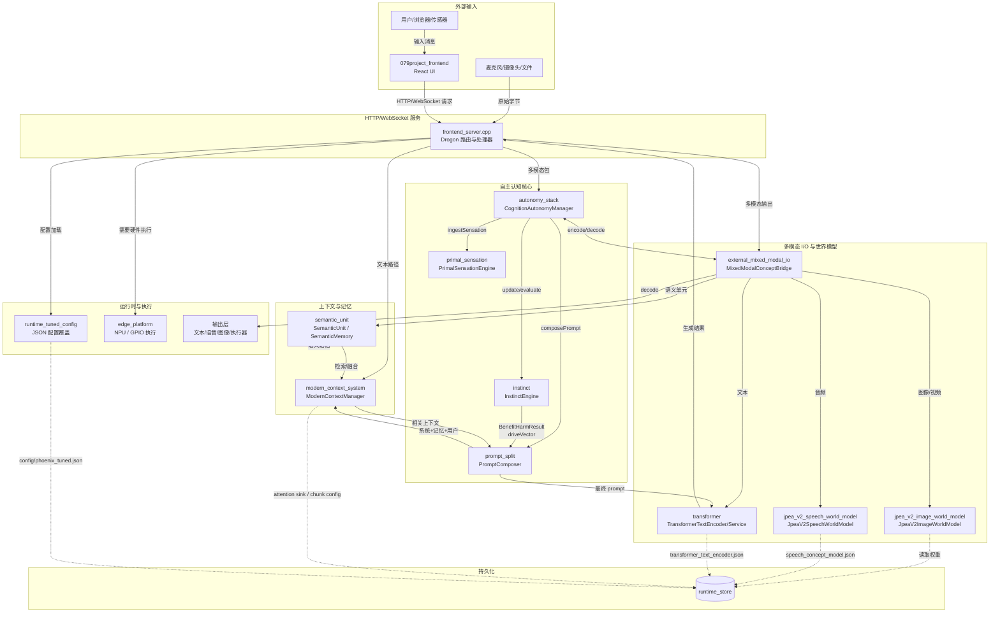

# Phoenix v7.0 "Arthur" 系统流程图

> 完整架构与数据流总览见 [`dataflow.md`](./dataflow.md)；本文件按 **模块、类、函数** 三种粒度，使用 Mermaid 绘制完整系统流程。节点命名尽量与源码一致。

---

## 1. 模块粒度系统流程

---

## 2. 类粒度系统流程

```mermaid
flowchart TD
    subgraph UI["前端层"]
        APP[079project_frontend<br/>App.js]
        HANDLER[frontend_server.cpp<br/>HTTP 处理器]
    end

    subgraph AUTONOMY["自主栈"]
        CAM["autonomy::CognitionAutonomyManager"]
        PSE["phoenix::primal::PrimalSensationEngine"]
        PS["phoenix::primal::PrimalSensation"]
        IENG["phoenix::instinct::InstinctEngine"]
        INSTOBJ["phoenix::instinct::Instinct"]
        BHR["phoenix::instinct::BenefitHarmResult"]
    end

    subgraph PROMPT["Prompt 双分"]
        SYS["phoenix::prompt::SystemPrompt"]
        MEMPR["phoenix::prompt::MemoryPrompt"]
        PC["phoenix::prompt::PromptComposer"]
    end

    subgraph MMIO["混合模态桥"]
        MMP["phoenix::io::MixedModalPacket"]
        BRIDGE["phoenix::io::MixedModalConceptBridge"]
        INBUF["phoenix::io::MixedModalInputBuffer"]
        OUTQ["phoenix::io::MixedModalOutputQueue"]
        REG["phoenix::io::MixedModalChannelRegistry"]
    end

    subgraph WM["世界模型"]
        IMGIF["phoenix::io::JpeaV2ImageWorldModel"]
        IMGF["phoenix::io::JpeaV2ImageFallbackModel"]
        SPKIF["phoenix::io::JpeaV2SpeechWorldModel"]
        SPKF["phoenix::io::JpeaV2SpeechFallbackModel"]
    end

    subgraph TXT["文本/Transformer"]
        TS["transformer::TransformerService"]
        TM["transformer::TransformerModel"]
        TOK["transformer::Tokenizer"]
        TTE["phoenix::io::TransformerTextEncoder"]
    end

    subgraph SEMU["语义单元与记忆"]
        SU["phoenix::multimodal::SemanticUnit"]
        SM["phoenix::multimodal::SemanticMemory"]
        CTXM["phoenix::context::ModernContextManager"]
        CTXE["phoenix::context::ContextEntry"]
        ASM["phoenix::context::AttentionSinkManager"]
    end

    subgraph CFG["配置"]
        RTC["phoenix::tuned::loadTunedConfig"]
        PCC["phoenix::Config"]
    end

    APP -->|HTTP 请求| HANDLER
    HANDLER -->|observe/iterate| CAM
    HANDLER -->|ingestMixedModalPacket| CAM

    CAM -->|add| PSE
    PSE -->|active| IENG
    PSE -->|PrimalSensation| PS
    IENG -->|Instinct| INSTOBJ
    IENG -->|BenefitHarmResult| BHR
    BHR -->|driveVector| MEMPR

    CAM -->|setMemory| PC
    SYS -->|system_| PC
    MEMPR -->|memory_| PC
    PC -->|compose/composeMessages| TS

    CAM -->|encode| BRIDGE
    CAM -->|decode| BRIDGE
    CAM -->|pretrainSpeech| BRIDGE
    BRIDGE -->|textEncoder| TTE
    BRIDGE -->|imageWorldModel| IMGIF
    BRIDGE -->|speechWorldModel| SPKIF
    IMGIF -->|fallback| IMGF
    SPKIF -->|fallback| SPKF
    BRIDGE <-->|SemanticUnit| SU

    SU -->|retrieve/fuse| SM
    SU -->|addEntry/addSemanticUnit| CTXM
    CTXM -->|ContextEntry| CTXE
    CTXM -->|AttentionSinkManager| ASM

    TS -->|model_| TM
    TM -->|tokenizer_| TOK
    TTE -->|model_| TM

    RTC -->|覆盖配置| PCC
    PCC -->|RuntimeConfig| TS
    PCC -->|RuntimeConfig| EDGE

    CAM -->|inputBuffer_| INBUF
    CAM -->|outputQueue_| OUTQ
    CAM -->|channelRegistry_| REG

    HANDLER -->|输出响应| APP
    BRIDGE -->|输出包| OUTQ
```

---

## 3. 函数粒度系统流程

---

## 说明

- **模块粒度** 展示系统主要模块与数据流向。
- **类粒度** 展示核心类之间的协作关系。
- **函数粒度** 展示一次典型多模态输入到自主响应的完整调用链。
- 图中 `fallback` 路径表示当前尚未接入真实 PyTorch/HuggingFace 后端时的确定性实现，真实权重下载后可在 `createJpeaV2ImageWorldModel` / `createJpeaV2SpeechWorldModel` 中选择后端。
