# Phoenix v7.0 "Arthur" 系统流程与数据流

> 本文档由原先的 `workflow.md` 与 `dataflow.md` 合并而来，集中描述 Phoenix v7.0 的系统流程、数据流、核心类协作以及启动配置。原先的 `dataflow.md` 已删除，相关内容已全部并入本节。
>
> **命名约定（重要）**：GNN 之前的、承担多模态预处理（文本/图像/音频/视频/传感器编码、记忆摘要、情感感知）的整体概念模块统一称为 **`aheadModule`**（"前置模块"）。它不是某一个 `.cpp` 文件，而是对 §1 中 `MOD`（世界模型/编码器）、`COG`（自主认知层）、记忆摘要与情感子系统的**统一概念命名**，用来与 GNN、MemeBarrier、Backend（llama3.1 8b 的 enc/inference/dec）区分开。`frontend_server.cpp` 只是 HTTP/静态资源反向代理进程，**不等同于** `aheadModule`；下文所有提到 "aheadModule" 的图/表都指向这一概念层，具体落地类见 §1、§4、§5。

---

## 0. v7.0 目标架构总览（aheadModule → GNN → MemeBarrier → Backend）

本节描述 v7.0 的目标数据流主干，覆盖以下关键设计点（详见 `algorithm.md` 与 `model_deployment.md` 的对应章节）：

1. 输入模态：文本、图像、音频、视频、传感器，统一由 **aheadModule** 接收并编码；文本可复用 **llama3.1 8b 自带的 embedding/encoder 部分**（见 §0.4），音频/视频编码器由 aheadModule 内部实现（对应现有 `AudioModel` / `VideoModel`）。
2. **记忆模块（Memory）**：RNN/LSTM/Transformer 摘要器，输出**并行双分支**——一路直达 Backend（作为 prompt 的记忆片段），一路进入 GNN/MemeBarrier（作为图检索的查询上下文）。两路是同一份摘要的两个只读副本，互不阻塞、互不等待。
3. **情感 / 心境（Emotion / Sentiment）**：情感层观测“输入 + 内部状态”，sentiment/aheadModule 对情感做调制；情感层**不直接对 Backend 权重矩阵做乘法**，而是通过 prompt 调制、logit bias、temperature 三种有据可查的机制影响 Backend 的生成（见 §0.5、`algorithm.md` §12）。
4. **GNN / MemeBarrier**：GNN 存取语义单元（meme）并提供图上下文；MemeBarrier 是一层安全/语义过滤器，出现在两个位置——GNN 与用户之间、以及 Backend 输出与用户之间。
5. **Backend**：llama3.1 8b 在编译期/运行期被拆分为三段——`enc`（token embedding / 输入投影）、`inference`（llama-server 主体）、`dec`（LM head / 输出投影，音视频场景下由运行期代码实现，因为 `.gguf` 权重不入库）。
6. **句子生成模块（如 TinyLlama）**输出文本后，同样产生两个只读副本：一份给 Backend（继续拼接/增强下一轮 prompt），一份给 MemeBarrier（做安全检查并可能写回 GNN）；两者是**并行**关系，不是串行流水线。
7. **异步执行**：不使用单一中心事件循环，改用**按模块的优先级任务队列 + work-stealing 线程池**（见 §0.6、`algorithm.md` §13）。

### 0.1 总体流程图

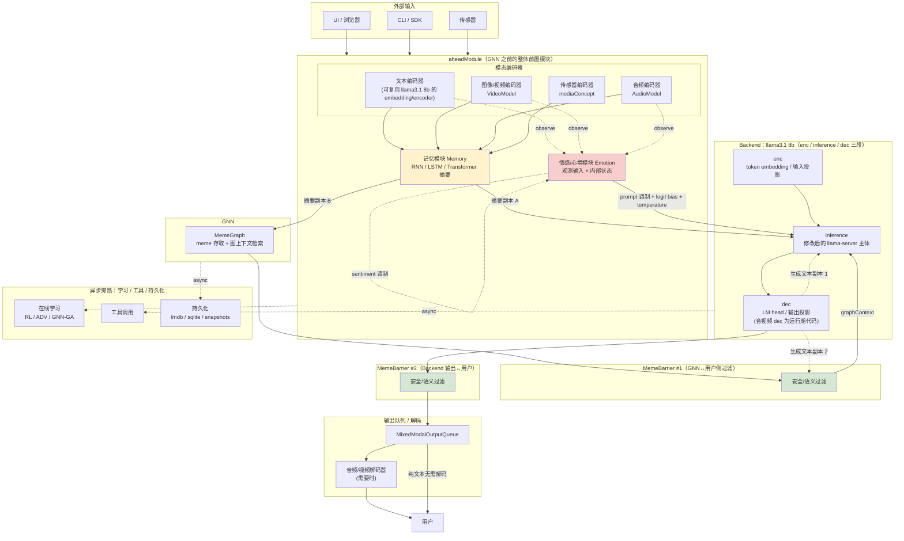

### 0.2 与现有实现的映射关系

| 目标架构角色 | 现有/规划实现 | 说明 |
|---|---|---|
| `aheadModule`（概念层） | `external_mixed_modal_io`、`video_model`、`audio_model`、`transformer::TransformerTextEncoder`、`autonomy_stack`（部分） | 不是单一文件，是这些模块的统称 |
| 记忆模块 Memory | `TorchTextModels`（RNN/LSTM）+ `SummaryModel`/TinyLlama（Transformer 摘要）+ `ModernContextManager` | 双分支输出见 §2 |
| 情感/心境 Emotion | `PrimalSensationEngine` + `InstinctEngine` + `BenefitHarmResult.driveVector` | 影响机制升级为 prompt/logit-bias/temperature，见 §0.5 |
| GNN | `MemeGraph` + `KVMStore/LMDB` | 已实现 |
| MemeBarrier | `MemeBarrier`（TextCNN + RNN/LSTM 异常扫描） | v7.0 起职责扩展为两处过滤点（GNN↔用户、Backend 输出↔用户），见 §0.3 |
| Backend enc/inference/dec | `llama-server`（打补丁）+ `TransformerService` | 详见 §0.4 与 `model_deployment.md` |
| 异步执行 | 目标：per-module 优先级队列 + work-stealing 线程池 | 替代任何中心 event loop，见 §0.6 |

### 0.3 MemeBarrier 的双重角色

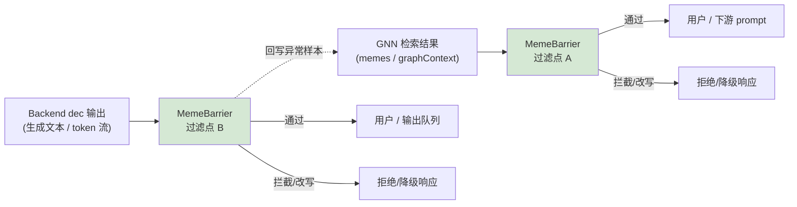

MemeBarrier 在 v6.0 中已经承担“GNN 异常扫描”角色（见 §1 中 `MG -->|异常扫描| MM`）；v7.0 明确将其复制为**两个逻辑过滤点**：

- **过滤点 A**：位于 GNN 与后续消费者（prompt 组装 / 用户）之间，防止图中被污染的 meme 直接进入上下文。
- **过滤点 B**：位于 Backend 的 `dec` 输出与用户之间，对最终生成文本做最后一道安全/语义检查（毒性、越权指令、幻觉引用等）。

两个过滤点复用同一套 TextCNN + RNN/LSTM 分类器和规则引擎，但独立评估各自的输入，不共享调用上下文（避免 A 通过就默认 B 通过）。

### 0.4 Backend：llama3.1 8b 的 enc / inference / dec 三段拆分

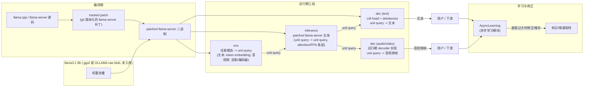

**要点**：

- `enc`、`inference`、`dec` 是**同一个 llama3.1 8b 模型**在运行时按职责切出的三个逻辑段，不是三个独立训练的模型。贯穿三段的数据单元是 **unit query**（语义/概念向量），而 `text / audio / video` 只在 `enc` 之前（输入侧）和 `dec` 之后（输出侧）出现：
  - `enc` = 任意模态 -> unit query。对文本是 token embedding 查表；在 aheadModule 完成跨模态对齐后，音视频的语义向量也通过输入投影映射进 llama 的 embedding 空间。
  - `inference` = unit query -> unit query。运行 `llama-server` 的 attention/FFN 主体，输出仍是隐藏状态/语义向量；**不直接输出 text/audio/video**。它在编译期打了 tracked patch，以支持情感 logit-bias 钩子、分段抽取隐藏状态等 v7.0 所需接口。补丁以 git 版本化的 diff/patch 文件形式提交仓库，编译脚本在构建 `llama-server` 之前应用它。
  - `dec` = unit query -> 输出模态。对纯文本，`dec` 使用 LM head 产生 token 后再 detokenize 为文本；对**音频/视频**，`.gguf` / raw blob 中并不包含解码到波形/像素的权重，因此这部分 `dec` 由 Phoenix 自己的运行期 C++ 代码实现（对应 `audio_model.cpp` / `video_model.cpp` 的 `decode()`），从概念向量还原为音视频载荷。
- `dec` 的输出**不回传给 `inference`**。最终模态输出首先返回给用户/下游，同时进入 `AsyncLearning`（异步学习模块）学习其中与当前知识/情感矩阵差距较大的部分，并异步修正或增补矩阵。
- 针对**文本型 8B 模型**的自回归实现说明：当前 `llama3.1:8b` 是 token-based 模型，必须逐 token 采样才能继续生成。`llama-server` 的 `POST /phx/generate` 端点把这段 enc/infer/dec 采样循环封装在服务端完成，客户端在 `apply-template` 后直接调用 `/phx/generate` 即可获得最终文本。这是**文本模型在当前阶段的实现折中**，不是概念流：概念上 `inference` 仍然是 unit query -> unit query，`dec` 仍是最终输出边界；`enc` 的临时使用相当于把 `inference` 产出的 unit query 先交给 `dec` 预览出一个 token，再把该 token 作为下一轮输入重新编码。
- 未来优化方向：如果模型的 `inference` 能直接生成下一时刻的 unit query（而非先通过 `dec` 采样 token 再 `enc` 回 unit query），就可以在自回归过程中完全削去 `enc` 与 `dec`，只保留 `inference` 一路生成 unit query 序列，最后根据用户需求统一交给对应的 `dec`（文本用 LM head，音视频用 JEPA decoder）一次性解码。当前 8B token-based 模型无法做到这一点，因为 `infer` 必须知道下一个 token 的 embedding 才能计算下一层 hidden state；`enc` 与 `dec` 在数学上也不是可逆运算。
- 现状说明：`llamacpp_emotion_adjuster.cpp` 中的 `onForwardPassBegin/End` 目前是占位日志（因为未打自定义补丁的社区 llama.cpp 不暴露逐层权重张量）；上图中的“tracked patch”是让这些钩子从占位变为真实可用所需的编译期改造，属于 v7.0 目标而非已完成实现，文档中以此标注。

### 0.5 情感对 Backend 的影响机制（有据可查的三通道）

情感层**不**对 Backend 的权重矩阵做原始小矩阵乘法（v6.0 曾有“固定线性矩阵 → 8 维 driveVector”的魔数矩阵设计；v7.0 已改为规范映射 `emotion::fromAppraisal` / `padToTensor`，见 `algorithm.md` §15，同样只用于生成 prompt 里的数值提示，从未直接乘到 llama 权重上）。v7.0 明确采用三种在可控文本生成文献中有支持的机制：

1. **Prompt 调制（Prompt Modulation）**：将情感状态（如 `driveVector` 或高层标签）转成自然语言/结构化片段注入 `MemoryPrompt`（沿用 `PromptComposer`），属于“情感条件化生成”（affect-conditioned generation），参考 CTRL（Keskar et al., 2019）式的控制码前缀思路。
2. **Logit Bias（词表偏置）**：在 `dec` 输出 logits 之后、采样之前，对特定 token/token 群组加一个与情感强度相关的偏置向量，参考 Plug-and-Play Language Models（Dathathri et al., 2020, PPLM）与 DExperts（Liu et al., 2021）等“解码期引导”方法——不需要重训主模型，只在采样前对 logits 做加法偏移。
3. **Temperature（采样温度）调节**：用 arousal/valence 映射到采样温度和 top-p，唤醒度高（arousal 高）时提升 temperature（更发散/更情绪化的措辞），唤醒度低时降低 temperature（更保守/更平稳）；这是 llama.cpp/llama-server 已经原生支持的采样参数，零侵入。

```mermaid
flowchart TB
    OBS["观测：输入 + 内部状态"] --> EMO["Emotion 层<br/>PrimalSensationEngine + InstinctEngine"]
    SENT["sentiment / aheadModule 特征"] -->|调制| EMO
    EMO -->|driveVector [valence,arousal,...]| MAP["映射函数"]

    MAP -->|自然语言/结构化片段| P1["① Prompt 调制<br/>MemoryPrompt.benefitHarmBias"]
    MAP -->|Δlogits 向量| P2["② Logit Bias<br/>采样前对 logits 加偏置"]
    MAP -->|temperature, top_p| P3["③ Temperature/Top-p 调节"]

    P1 --> PROMPT_IN["拼入最终 prompt"] --> ENC0["Backend enc"]
    P2 --> SAMPLER["Backend dec 采样阶段"]
    P3 --> SAMPLER

    ENC0 --> INF0["Backend inference"] --> SAMPLER --> GEN["生成结果"]

    style P1 fill:#fff2cc
    style P2 fill:#fff2cc
    style P3 fill:#fff2cc
```

详见 `algorithm.md` §15（情感影响算法）与 `model_deployment.md`（情感模块部署形态）。与 `model_deployment.md`（情感模块部署形态）。

### 0.6 异步执行模型：per-module 优先级队列 + work-stealing 线程池（不使用中心事件循环）

v7.0 明确**不**采用单一中心 `event loop`（例如单线程 `epoll`/`libuv` 风格的全局调度器）来串行分发 aheadModule、GNN、MemeBarrier、Backend 之间的任务，原因：

- 中心事件循环下，一个慢任务（如一次远程 BPU 推理超时）会阻塞该循环上排队的所有其他模块的回调，形成级联延迟；v6.0 已经在 `chatWithExternalAdapter`/TinyLlama 调用上吃过“单线程忙等待导致超时”的教训（见 §2 说明 5、§13）。
- 各子系统的延迟特征差异很大（GNN 检索是微秒级，llama-server 推理是百毫秒到秒级，音视频编解码是几十毫秒级），用同一个循环的同一优先级调度会导致低延迟任务被高延迟任务饿死或反之。
- Phoenix 已经存在多个独立的后台流水线（`episodicStage_`、`rnnStage_`、`MemeBarrier` 后台线程、`ControllerPool`），说明现有系统本身就是多线程池模型，而不是单事件循环；v7.0 只是把这一模式系统化、显式化。

目标设计：**每个模块拥有一个带优先级的任务队列**，所有队列共享一个 **work-stealing 线程池**：空闲 worker 从自己队列取任务，取不到时从其他 worker 的队列尾部“偷”一个任务，从而在保持模块级隔离（故障/延迟不跨模块传播）的同时避免线程闲置。

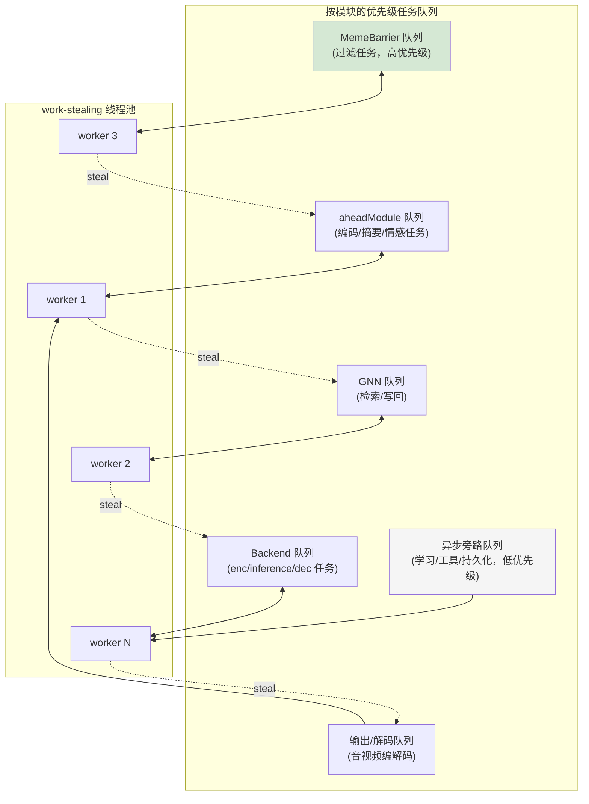

调度细节、任务优先级取值与伪代码见 `algorithm.md` §13；线程池部署（core 数量、亲和性）见 `model_deployment.md`。

---

## 1. 整体架构（按子系统分层）

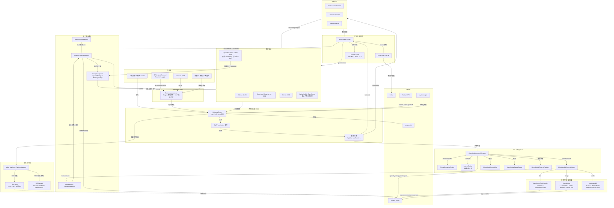

**说明**：

1. 外部请求统一经过 `frontend_server.cpp` 反向代理到达网关 `GatewayServer`；网关负责鉴权、路由、记忆图（MemeGraph）、上下文、自主认知层以及推理后端调度；边缘层负责将部分算子或权重下放到 NPU/MCU 执行；持久化层为所有子系统提供状态保存与恢复能力。
2. **TinyLlama** 作为独立的轻量摘要/短文本后端运行，位于 GNN 图摘要与主 LLM 之间，负责把 top-k memes / keywords 生成自然语言摘要，并支持 `model/explain` 等短生成任务；主文本生成仍由 Ollama / llama.cpp / BitNet / Native Transformer 承担。
3. `frontend_server.cpp` 中的 `SummaryModel` 默认走 TinyLlama（`summary_model.useTinyllama=true`），不再在启动时加载并训练本地 Transformer；当 TinyLlama 不可用时 fallback 为关键词云。

---

## 2. `/api/chat` 请求生命周期

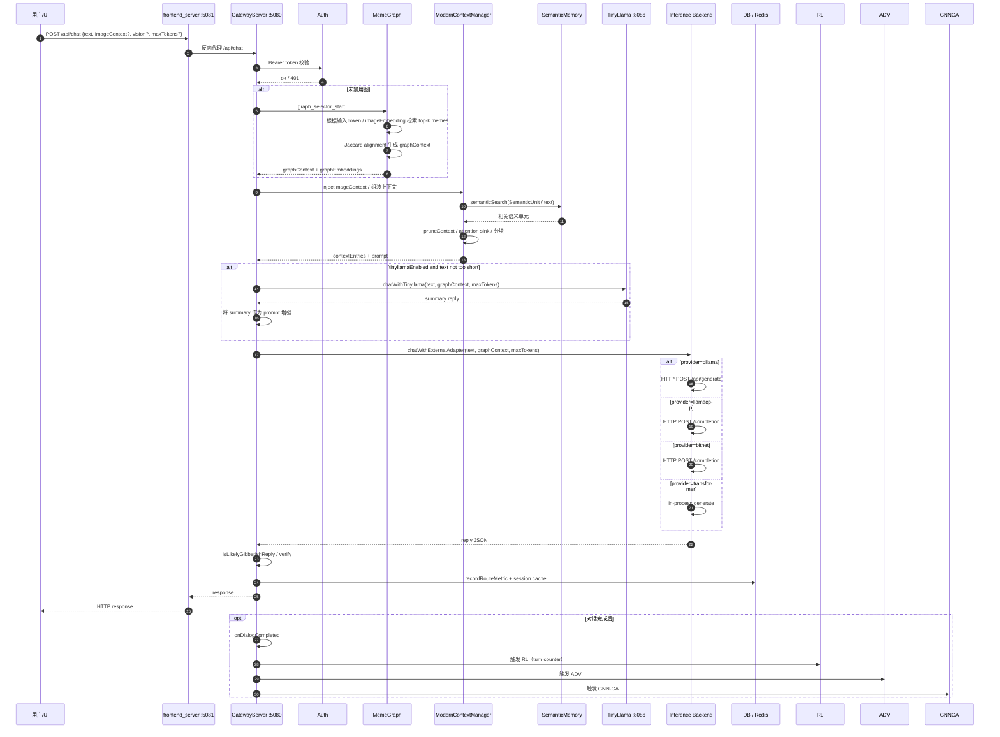

**说明**：

1. `frontend_server.cpp` 仅做代理，不处理业务逻辑。
2. 鉴权支持 JWT 与 `local-{user}-{ts}-{seq}` 本地 token。
3. `/api/chat` 默认启用 MemeGraph selector，可通过 `disableGraphSelector` 关闭。
4. 图像上下文通过 `injectImageContext` 注入，可能进入 `video_model` 编码为语义单元。
5. **v7.0 更新**：当 `tinyllamaEnabled=true` 且输入文本达到一定长度时，网关会先调用 TinyLlama 生成 `summary`，并把摘要拼入最终 prompt，再调用主 LLM；同时 `chatWithExternalAdapter` 对 `graphContext` 和 `prompt` 做上限限制，避免 `std::bad_alloc`，并受 `llamaCppRequestTimeoutMs` / `tinyllamaRequestTimeoutMs` 等超时保护。
6. 生成完成后会进行 `isLikelyGibberishReply` 与可选的 verify，并异步触发在线学习。

### 2.1 记忆双分支与句子生成双副本（并行，非串行）

v7.0 明确记忆模块与句子生成模块的输出都是**扇出（fan-out）而非流水线（pipeline）**：下游两个消费者拿到的是同一份数据的两个只读副本，谁先处理完不影响另一个，二者之间没有先后依赖。

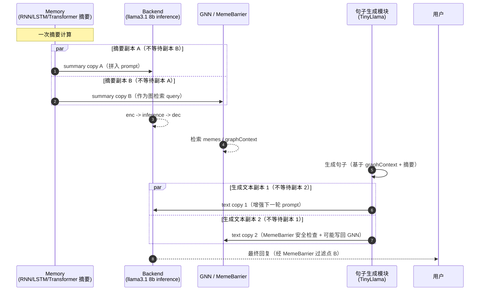

**要点**：

- `par ... and ... end` 表示两条分支是**并发**执行的：`Backend` 分支即使耗时更长（一次 llama-server 推理），也不会阻塞 `GNN/MemeBarrier` 分支先行完成检索/写回，反之亦然。
- 这与 v6.0 现有的 `TinyLlama -> summary -> 拼入 prompt -> 主 LLM` 串行链路（见 §2 步骤 8-9）不同：v7.0 要求摘要/生成文本对 Backend 和对 GNN/MemeBarrier 的两条路径解耦为独立任务，分别提交到 §0.6 的 per-module 队列。
- 实现落地时，两条分支应各自持有摘要/文本的不可变拷贝（或共享只读引用 + 引用计数），避免其中一条分支修改数据影响另一条。

---

## 3. 多模态真连接数据流

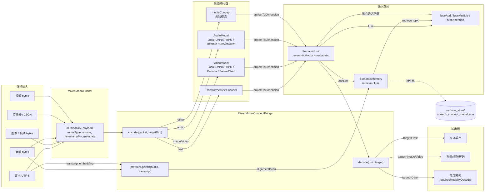

**说明**：

- `MixedModalPacket` 是统一的外部输入/输出容器；`MixedModalConceptBridge` 负责将不同模态编码到同一语义空间。
- 文本走 `TransformerTextEncoder`；图像/视频优先使用 `VideoModel`（真实后端可切换为 RDK X5 BPU 或 PyTorch）；音频使用 `AudioModel`，并可通过 `pretrainSpeech` 与文本对齐。
- 所有语义向量通过 `projectToDimension` 对齐到目标维度，实现不重新训练 LLM 的跨模态融合。
- 解码时，非文本目标输出概念载荷并标记 `requiresModalityDecoder`，由外部解码器实体化。

---

## 4. 自主认知层（Autonomy Stack）内部循环

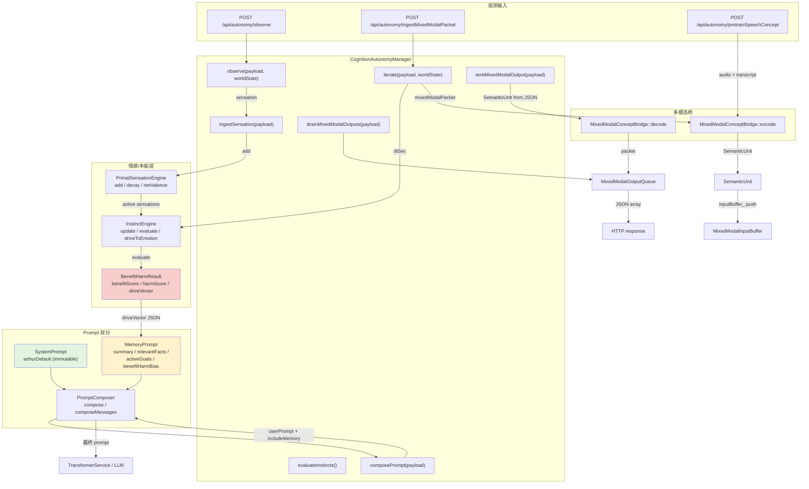

**说明**：

- `observe()` 接收外部观测，可包含原生感受（sensation）或多模态包；`iterate()` 是主循环，每次计算时间差 `dtSec` 并更新本能强度。
- `InstinctEngine::update()` 按目标契合度 appraisal（软亲和度 × 强度 × 效价）与时间半衰期更新当前激活度；`evaluate()` 用效用形式 B/H/U 计算 benefit/harm，`driveVector` 由规范映射 `emotion::fromAppraisal` 产生（见 `algorithm.md` §7/§15）。
- `MemoryPrompt.benefitHarmBias` 不再硬编码为 `approach/avoid/wait`，而是直接写入 `driveVector` 数值权值，作为下游矩阵（如 logit-bias）的潜在信号。
- `SystemPrompt` 不可变，`MemoryPrompt` 每轮根据上下文和趋利避害结果重建。

---

## 5. 模块粒度系统流程

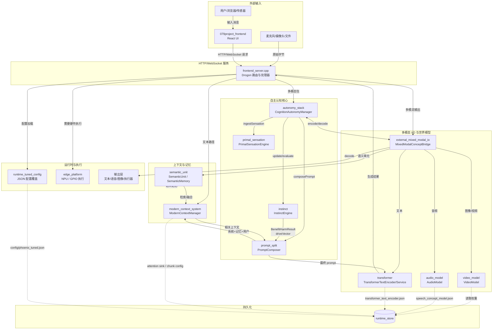

---

## 6. 类粒度系统流程

```mermaid
flowchart TD
    subgraph UI["前端层"]
        APP[079project_frontend<br/>App.js]
        HANDLER[frontend_server.cpp<br/>HTTP 处理器]
    end

    subgraph AUTONOMY["自主栈"]
        CAM["autonomy::CognitionAutonomyManager"]
        PSE["phoenix::primal::PrimalSensationEngine"]
        PS["phoenix::primal::PrimalSensation"]
        IENG["phoenix::instinct::InstinctEngine"]
        INSTOBJ["phoenix::instinct::Instinct"]
        BHR["phoenix::instinct::BenefitHarmResult"]
    end

    subgraph PROMPT["Prompt 双分"]
        SYS["phoenix::prompt::SystemPrompt"]
        MEMPR["phoenix::prompt::MemoryPrompt"]
        PC["phoenix::prompt::PromptComposer"]
    end

    subgraph MMIO["混合模态桥"]
        MMP["phoenix::io::MixedModalPacket"]
        BRIDGE["phoenix::io::MixedModalConceptBridge"]
        INBUF["phoenix::io::MixedModalInputBuffer"]
        OUTQ["phoenix::io::MixedModalOutputQueue"]
        REG["phoenix::io::MixedModalChannelRegistry"]
    end

    subgraph WM["世界模型"]
        IMGIF["phoenix::io::VideoModel"]
        IMGO["phoenix::io::VideoLocalOnnxModel / Hbdnn / Remote / ServerClient"]
        SPKIF["phoenix::io::AudioModel"]
        SPKO["phoenix::io::AudioLocalOnnxModel / Hbdnn / Remote / ServerClient"]
    end

    subgraph TXT["文本/Transformer"]
        TS["transformer::TransformerService"]
        TM["transformer::TransformerModel"]
        TOK["transformer::Tokenizer"]
        TTE["phoenix::io::TransformerTextEncoder"]
    end

    subgraph SEMU["语义单元与记忆"]
        SU["phoenix::multimodal::SemanticUnit"]
        SM["phoenix::multimodal::SemanticMemory"]
        CTXM["phoenix::context::ModernContextManager"]
        CTXE["phoenix::context::ContextEntry"]
        ASM["phoenix::context::AttentionSinkManager"]
    end

    subgraph CFG["配置"]
        RTC["phoenix::tuned::loadTunedConfig"]
        PCC["phoenix::Config"]
    end

    APP -->|HTTP 请求| HANDLER
    HANDLER -->|observe/iterate| CAM
    HANDLER -->|ingestMixedModalPacket| CAM

    CAM -->|add| PSE
    PSE -->|active| IENG
    PSE -->|PrimalSensation| PS
    IENG -->|Instinct| INSTOBJ
    IENG -->|BenefitHarmResult| BHR
    BHR -->|driveVector| MEMPR

    CAM -->|setMemory| PC
    SYS -->|system_| PC
    MEMPR -->|memory_| PC
    PC -->|compose/composeMessages| TS

    CAM -->|encode| BRIDGE
    CAM -->|decode| BRIDGE
    CAM -->|pretrainSpeech| BRIDGE
    BRIDGE -->|textEncoder| TTE
    BRIDGE -->|videoEncoder| IMGIF
    BRIDGE -->|audioEncoder| SPKIF
    IMGIF -->|factory| IMGO
    SPKIF -->|factory| SPKO
    BRIDGE <-->|SemanticUnit| SU

    SU -->|retrieve/fuse| SM
    SU -->|addEntry/addSemanticUnit| CTXM
    CTXM -->|ContextEntry| CTXE
    CTXM -->|AttentionSinkManager| ASM

    TS -->|model_| TM
    TM -->|tokenizer_| TOK
    TTE -->|model_| TM

    RTC -->|覆盖配置| PCC
    PCC -->|RuntimeConfig| TS
    PCC -->|RuntimeConfig| EDGE

    CAM -->|inputBuffer_| INBUF
    CAM -->|outputQueue_| OUTQ
    CAM -->|channelRegistry_| REG

    HANDLER -->|输出响应| APP
    BRIDGE -->|输出包| OUTQ
```

---

## 7. 函数粒度系统流程

```mermaid
flowchart TD
    subgraph IN["用户输入入口"]
        UI["App.js 发送 HTTP"]
        FS_R_Text["frontend_server.cpp<br/>处理 /chat 或 /api/autonomy/observe"]
        FS_R_MM["frontend_server.cpp<br/>处理 /api/autonomy/ingestMixedModalPacket"]
    end

    subgraph CAM_F["CognitionAutonomyManager 函数"]
        CAM_observe["observe(payload, worldState)"]
        CAM_iterate["iterate(payload, worldState)"]
        CAM_ingest["ingestMixedModalPacket(payload)"]
        CAM_pretrain["pretrainSpeechConcept(payload)"]
        CAM_emit["emitMixedModalOutput(payload)"]
        CAM_drain["drainMixedModalOutputs(payload)"]
        CAM_compose["composePrompt(payload)"]
        CAM_eval["evaluateInstincts()"]
        CAM_sens["ingestSensation(payload)"]
    end

    subgraph PRIMAL_F["原生感受函数"]
        PSE_add["PrimalSensationEngine::add(s)"]
        PSE_active["PrimalSensationEngine::active()"]
        PSE_decay["PrimalSensationEngine::decay(halfLife, dt)"]
        PSE_val["PrimalSensationEngine::netValence()"]
        PSE_arous["PrimalSensationEngine::netArousal()"]
        PS_from["PrimalSensation::fromJson(j)"]
    end

    subgraph INST_F["本能函数"]
        IENG_update["InstinctEngine::update(sensations, dtSec)"]
        IENG_eval["InstinctEngine::evaluate(sensations, temperature)"]
        IENG_drive2emo["InstinctEngine::driveToEmotion(result)"]
        IENG_evalAction["InstinctEngine::evaluateAction(action, sensations)"]
    end

    subgraph PROMPT_F["Prompt 函数"]
        SYS_default["SystemPrompt::arthurDefault()"]
        MEM_empty["MemoryPrompt::empty()"]
        PC_compose["PromptComposer::compose(userPrompt, includeMemory)"]
        PC_msgs["PromptComposer::composeMessages(userPrompt, includeMemory)"]
        PC_fromCtx["PromptComposer::fromContext(context, maxFacts)"]
        PC_fromSemMem["PromptComposer::fromSemanticMemory(memory, query, topK)"]
    end

    subgraph BRIDGE_F["混合模态桥函数"]
        BRIDGE_encode["MixedModalConceptBridge::encode(packet, targetDim, hint)"]
        BRIDGE_decode["MixedModalConceptBridge::decode(unit, target, source)"]
        BRIDGE_pretrain["MixedModalConceptBridge::pretrainSpeech(audio, transcript, targetDim)"]
        BRIDGE_status["MixedModalConceptBridge::status()"]
        MMP_toSU["MixedModalPacket::toSemanticUnit(targetDim, hint)"]
        MMP_fromJson["MixedModalPacket::fromJson(j)"]
        MMP_toJson["MixedModalPacket::toJson()"]
    end

    subgraph WM_F["世界模型函数"]
        CREATE_IMG["createVideoModel(variant, targetDim)"]
        IMG_encode["VideoLocalOnnxModel/Hbdnn/Remote::encode(...)"]
        IMG_decode["VideoLocalOnnxModel/Hbdnn/Remote::decode(...)"]
        IMG_status["VideoModel::status()"]
        CREATE_SPK["createAudioModel(variant, targetDim)"]
        SPK_encode["AudioLocalOnnxModel/Hbdnn/Remote::encode(...)"]
        SPK_adapt["AudioLocalOnnxModel/Hbdnn/Remote::adapt(...)"]
    end

    subgraph TXT_F["文本编码/生成函数"]
        TTE_load["TransformerTextEncoder::load()"]
        TM_encode["TransformerModel::encode(tokens)"]
        TM_gen["TransformerModel::generate(...)"]
        TS_chat["TransformerService::chat(text, graphContext, maxTokens)"]
        TOK_encode["Tokenizer::encode(text)"]
    end

    subgraph SEM_F["语义单元/上下文函数"]
        SU_toJson["SemanticUnit::toJson()"]
        SU_fromJson["SemanticUnit::fromJson(j)"]
        PROJ["projectToDimension(v, targetDim, seed)"]
        FUSE_ATT["fuseAttention(query, units, targetDim)"]
        SM_add["SemanticMemory::addUnit(unit)"]
        SM_ret["SemanticMemory::retrieve(query, topK)"]
        CTX_addU["ModernContextManager::addSemanticUnit(unit, role)"]
        CTX_get["ModernContextManager::getContext(maxTokens)"]
        CTX_search["ModernContextManager::semanticSearch(query, topK)"]
        CTX_prune["ModernContextManager::pruneContext()"]
    end

    subgraph OUT["输出与持久化"]
        WRITE_RSCM["保存 speech_concept_model.json"]
        WRITE_TTE["保存 transformer_text_encoder.json"]
        OUT_HTTP["HTTP 响应回前端"]
        OUT_ACT["执行器 / 语音 / 图像输出"]
    end

    UI --> FS_R_Text
    UI --> FS_R_MM

    FS_R_Text --> CAM_observe
    FS_R_Text --> CAM_iterate
    FS_R_MM --> CAM_ingest

    CAM_observe -->|sensation| CAM_sens
    CAM_observe -->|mixedModalPacket| CAM_ingest
    CAM_sens --> PSE_add
    PSE_add --> PSE_active
    PSE_active --> PSE_decay

    CAM_ingest --> MMP_fromJson
    MMP_fromJson --> MMP_toSU
    MMP_toSU --> BRIDGE_encode

    BRIDGE_encode -->|text| TOK_encode
    TOK_encode --> TM_encode
    BRIDGE_encode -->|image| CREATE_IMG
    CREATE_IMG --> IMG_encode
    BRIDGE_encode -->|audio| CREATE_SPK
    CREATE_SPK --> SPK_encode
    BRIDGE_encode -->|other| PROJ

    IMG_encode --> PROJ
    SPK_encode --> PROJ
    TM_encode --> PROJ

    PROJ --> SU_toJson
    SU_fromJson --> BRIDGE_decode

    BRIDGE_encode --> SM_add
    SM_add --> SM_ret
    SM_ret --> CTX_addU
    CTX_addU --> CTX_get
    CTX_get --> CTX_prune
    CTX_search --> PC_fromCtx
    PC_fromCtx --> MEM_empty

    CAM_iterate -->|dtSec| IENG_update
    IENG_update --> IENG_eval
    IENG_eval --> IENG_drive2emo
    IENG_drive2emo --> PC_compose
    IENG_eval -->|action 评估| IENG_evalAction

    SYS_default --> PC_compose
    MEM_empty --> PC_compose
    PC_compose -->|最终 prompt| TS_chat
    PC_msgs --> TS_chat
    TS_chat --> TM_gen
    TM_gen --> OUT_HTTP

    CAM_pretrain --> BRIDGE_pretrain
    BRIDGE_pretrain -->|文本编码| TM_encode
    BRIDGE_pretrain -->|语音编码| SPK_encode
    BRIDGE_pretrain --> SPK_adapt
    SPK_adapt --> WRITE_RSCM

    TTE_load -->|读取| TM_encode
    TM_encode --> WRITE_TTE

    CAM_emit --> SU_fromJson
    SU_fromJson --> BRIDGE_decode
    BRIDGE_decode -->|image| IMG_decode
    BRIDGE_decode -->|text| OUT_HTTP
    IMG_decode --> OUT_ACT

    CAM_drain -->|packets| OUT_HTTP

    BRIDGE_status --> IMG_status
    BRIDGE_status -->|读取| WRITE_RSCM
    BRIDGE_status -->|读取| WRITE_TTE

    FS_R_Text -->|输出| OUT_HTTP
    FS_R_MM -->|输出| OUT_HTTP
```

---

## 8. 在线学习与数据生命周期

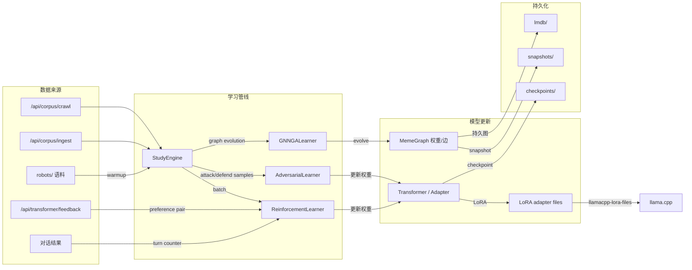

**说明**：

- 语料库 `robots/` 在启动时可选自动加载；外部文档通过 `/api/corpus/ingest` 或 `/api/corpus/crawl` 进入 `StudyEngine` 队列。
- 每完成一定轮数对话后自动触发 `RL / ADV / GNN-GA`；用户反馈通过 `/api/transformer/feedback` 收集并进入 RLHF replay buffer。
- GNN-GA 演化 MemeGraph 边权重；RL/ADV 更新 Transformer 参数或生成 LoRA adapter。

---

## 9. 边缘部署与 RDK X5 / NPU 数据流

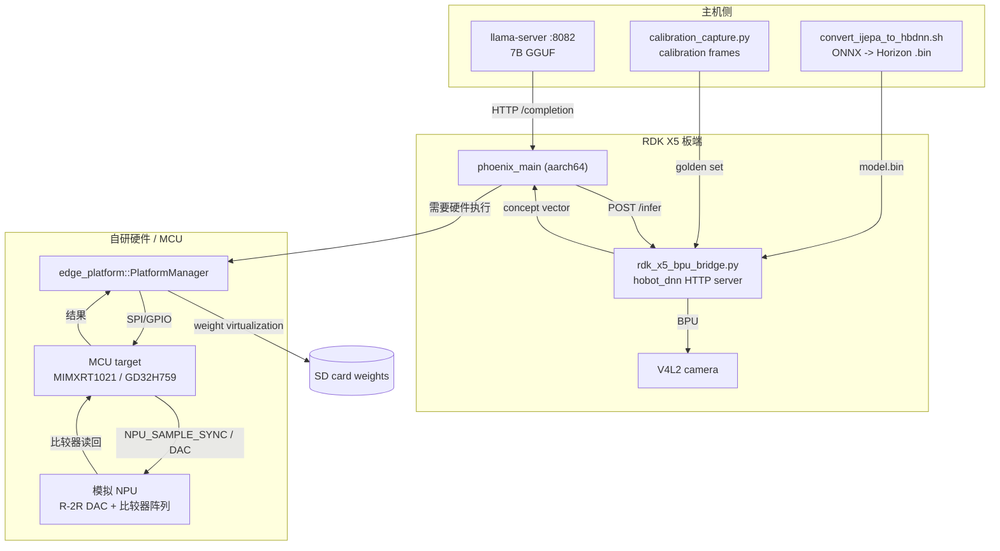

**说明**：

- 当前部署策略：LLM 推理放在主机 `llama-server`，X5 负责 BPU 视觉/编码器模型，C++ 网关通过 HTTP 与本地 Python BPU bridge 通信。
- `rdk_x5_bpu.cpp` 是 HTTP 客户端，`rdk_x5_bpu_bridge.py` 加载 `hobot_dnn` 编译后的 `.bin` 运行推理；任何错误 fail-closed，返回空向量并在 status JSON 中报告错误。
- 自研模拟 NPU 通过 `edge_platform` 控制 MCU（GD32H759/MIMXRT1021）进行 GPIO/SPI 调度、权重换页与算子分发。

---

## 10. 持久化与存储矩阵

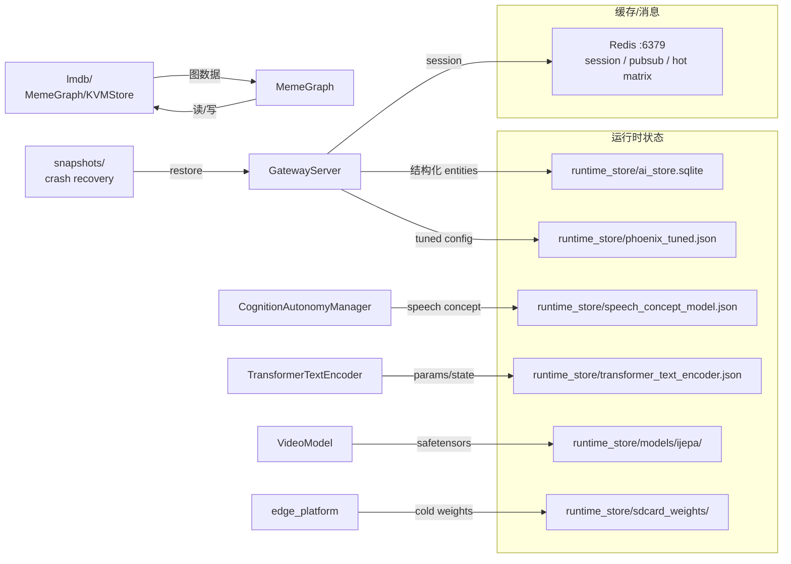

---

## 11. 核心类协作关系

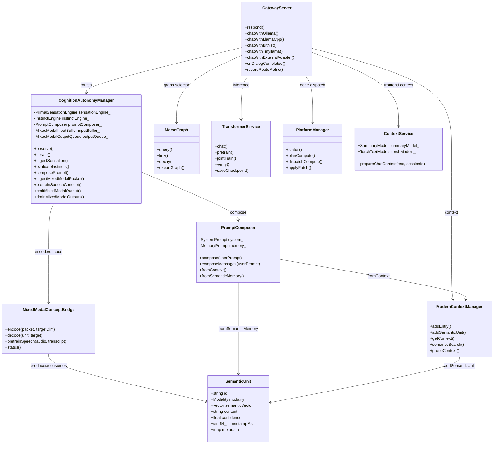

---

## 12. 配置加载与启动数据流

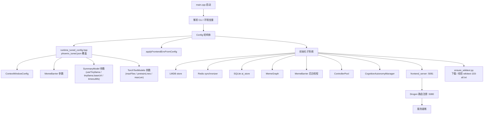

**说明**：

- 启动时 `ensure_wikitext.py` 会在 `robots/wikitext-103-all.txt` 缺失时自动从官方 `wikitext-103-raw-v1.zip` 下载并合并。
- `TorchTextModels::initFromCorpus` 优先读取 `wikitext-103-all.txt` 的前 `context.torch.pretrainLines` 行（默认 2000）对 RNN/LSTM 做预训练，再读取 `robotsDir` 下其他 `.txt` 文件做补充。
- `SummaryModel` 通过 `summary_model.useTinyllama` 开关决定走 TinyLlama 还是本地 seq2seq；默认启用 TinyLlama。

---

## 13. v7.0 关键实现更新

1. **Summary 摘要后端 TinyLlama 化**
   - 网关 `chatWithTinyllama` 与 `tinyllamaSummary` 已经可用，独立代理监听 `:8086`。
   - `frontend_server.cpp` 的 `SummaryModel` 默认改为通过 `drogon::HttpClient` 调用 TinyLlama `/api/chat` 生成摘要；本地 WikiText 训练作为 fallback。
2. **`/api/model/explain` 与 `/api/transformer/modernize` 避免本地 transformer 阻塞**
   - `model/explain` 不再无条件调用 `TransformerService::chat/verify`；当 `transformerBackend != native` 时改用 TinyLlama 或 llama.cpp 生成回复，避免 `transformerMu_` 长时间占用。
   - `transformer/modernize` 不再通过 `transformer_.params()` 加锁读取本地 transformer 参数，而是从 `payload` 或配置直接获取，避免 worker 锁死。
3. **数据清理 UTF-8 安全截断**
   - `sanitizeInputText` 在截断文本时改为按完整 UTF-8 字符边界截断，避免破坏多字节字符导致数据清理步骤超时。
4. **wikitext 自动下载与 RNN/LSTM 预训练**
   - 新增 `test-tools/ensure_wikitext.py`；训练/启动脚本自动调用。
   - `TorchTextModels` 明确使用 `wikitext-103-all.txt` 的受控行数做预训练，避免首次聊天因加载 500MB 大文件被阻塞。
5. **异步边界**
   - `SummaryModel` 训练与摘要生成已分别放入 `episodicStage_` 与 `rnnStage_` 后台流水线；网关内部短生成/摘要使用带超时的非阻塞 HTTP 调用，避免占用 Drogon HTTP worker 线程。
6. **测试覆盖**
   - `api_regression.ps1` 42/42 PASS。
   - `aa_ceval_web_bench.py` C-Eval 1/1 100%。
   - `aa_ceval_api_bench.py --dataset cmmlu` CMMLU 1/1 100%。

---

## 15. Backend 内部调用序列：enc → inference → dec

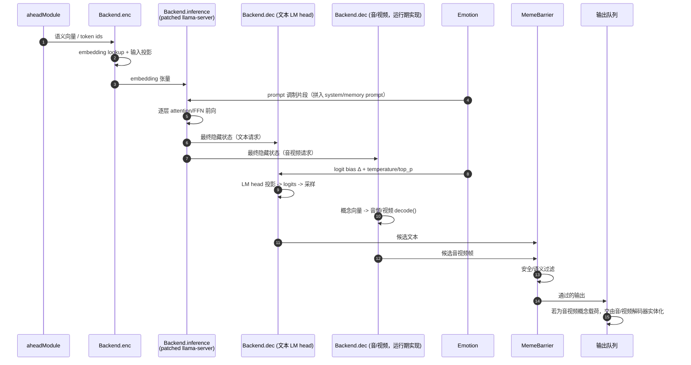

**说明**：

- `enc`、`inference`、`dec` 三段共享同一份 llama3.1 8b 权重；拆分是逻辑边界，不是物理上的三份权重文件。
- `Emotion` 对 `inference` 的作用是 prompt 调制（在 enc 之前已经拼入 prompt 文本，此处指该文本已经进入 attention 上下文）；对 `dec` 的作用是 logit bias 与采样参数，发生在 LM head 之后、采样之前。
- 音视频请求与文本请求共享 `enc`/`inference`，仅在 `dec` 处分叉：文本 `dec` 是 llama.cpp 原生 LM head；音视频 `dec` 是 Phoenix 自己维护的运行期代码（因为对应的解码权重不是 `.gguf` 的一部分，也不入库，需要单独训练/部署，见 `model_deployment.md`）。

---

## 16. 异步任务系统：模块队列 + work-stealing 线程池的运行时序

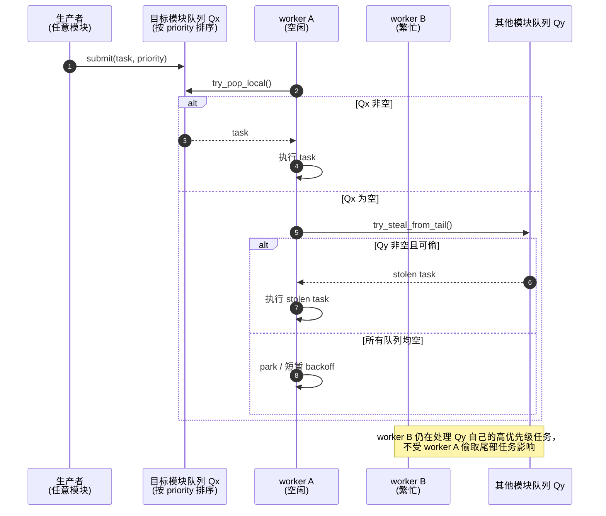

**为什么不用中心事件循环**（与 §0.6 呼应）：

1. **故障域隔离**：MemeBarrier、GNN、Backend 各自的队列独立，一个模块的任务积压不会阻塞其它模块的 worker 提交/执行新任务，只会让 work-stealing 更频繁地从它的队列尾部取走任务。
2. **优先级差异化**：MemeBarrier（安全过滤）与异步旁路（学习/工具/持久化）需要非常不同的优先级和延迟目标（前者应尽快执行，后者允许被无限期推迟），单一事件循环的单一优先级/单一 FIFO 语义无法同时满足。
3. **与现有实现一致**：现有代码已经是"多条独立后台流水线 + 线程池"的雏形（`episodicStage_`、`rnnStage_`、`MemeBarrier` 后台线程、`ControllerPool`、Drogon 自身的 IO 线程池），work-stealing 设计是对现状的系统化归纳，而不是推翻重做。
4. **可扩展性**：新增模块只需注册一个新队列并加入 work-stealing 线程池的偷取范围，不需要修改任何中心调度逻辑或状态机。

伪代码与队列/优先级的具体设计见 `algorithm.md` §13。

---

## 17. 版本与约定

- 本文件随 Phoenix v7.0 "Arthur" 同步维护。
- 所有节点命名尽量与源码中的类/函数/文件保持一致；`aheadModule` 是概念层命名，不对应单一源文件（见文件头说明）。
- 虚线箭头（`-.->`）表示持久化、配置读取或可选/低频路径；实线箭头（`-->`）表示主数据流；`par ... and ... end`（sequence 图）表示并行、非阻塞分支。
- 自本版本起，`workflow.md` 与 `dataflow.md` 合并为单一文件，原 `dataflow.md` 已删除。
- §0、§2.1、§15、§16 为 v7.0 目标架构新增内容，描述的是设计目标；未标注"已实现"的具体类/钩子（如 `llamacpp_emotion_adjuster.cpp` 的补丁化前向钩子）仍处于规划/演进阶段，见各节内的"要点"说明。
